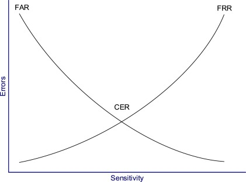

# ISC2 CISSP Study Guide, Seventh Edition

- [ISC2 CISSP Study Guide, Seventh Edition](#isc2-cissp-study-guide-seventh-edition)
  - [Chapter 1: Security Governance](#chapter-1-security-governance)
  - [Chapter 2: Personnel Security and Risk Management](#chapter-2-personnel-security-and-risk-management)
  - [Chapter 3: Business Continuity Planning](#chapter-3-business-continuity-planning)
  - [Chapter 4: Laws, Regulations, and Compliance](#chapter-4-laws-regulations-and-compliance)
  - [Chapter 5: Protecting Security of Assets](#chapter-5-protecting-security-of-assets)
  - [Chapter 6: Cryptography and Symmetric Key Algorithms](#chapter-6-cryptography-and-symmetric-key-algorithms)
  - [Chapter 7: PKI and Cryptographic Applications](#chapter-7-pki-and-cryptographic-applications)
  - [Chapter 8: Principles of Security Models, Design, and Capabilities](#chapter-8-principles-of-security-models-design-and-capabilities)
  - [Chapter 9: Security Vulnerabilities, Threats, and Countermeasures](#chapter-9-security-vulnerabilities-threats-and-countermeasures)
  - [Chapter 10: Physical Security Requirements](#chapter-10-physical-security-requirements)
  - [Chapter 11: Secure Network Architecture and Securing Network Components](#chapter-11-secure-network-architecture-and-securing-network-components)
    - [Cabling](#cabling)
      - [Coaxial Cable](#coaxial-cable)
      - [Baseband and Broadband Cables](#baseband-and-broadband-cables)
      - [Twisted-Pair](#twisted-pair)
      - [Conductors](#conductors)
    - [Network Topologies](#network-topologies)
      - [Ring](#ring)
      - [Bus](#bus)
      - [Star](#star)
      - [Mesh](#mesh)
    - [Wireless Communications and Security](#wireless-communications-and-security)
      - [Cell Phones](#cell-phones)
      - [Bluetooth](#bluetooth)
      - [Cordless Phones](#cordless-phones)
      - [Mobile Devices](#mobile-devices)
    - [LAN Technologies](#lan-technologies)
      - [Ethernet](#ethernet)
      - [Token Ring](#token-ring)
      - [FDDI](#fddi)
      - [Subtechnologies](#subtechnologies)
      - [LAN Media Access](#lan-media-access)
  - [Chapter 12](#chapter-12)
    - [Secure Communications Protocols](#secure-communications-protocols)
    - [Authentication Protocols](#authentication-protocols)
    - [Secure Voice Communications](#secure-voice-communications)
    - [Email Security](#email-security)
      - [Email Security Issues](#email-security-issues)
      - [Email Security Solutions](#email-security-solutions)
    - [Dial-Up Protocols](#dial-up-protocols)
    - [Centralized Remote Authentication Services](#centralized-remote-authentication-services)
    - [VPN](#vpn)
    - [VLAN, Virtual LAN](#vlan-virtual-lan)
    - [Virtualization](#virtualization)
    - [Network Address Translation](#network-address-translation)
    - [Switching Technologies](#switching-technologies)
    - [Prevent or Mitigate Network Attacks](#prevent-or-mitigate-network-attacks)
  - [Chapter 13: Managing Identity and Authentication](#chapter-13-managing-identity-and-authentication)
    - [subject vs object](#subject-vs-object)
    - [Access Control](#access-control)
      - [access control types](#access-control-types)
    - [CIA Triad](#cia-triad)
    - [Identification terms](#identification-terms)
    - [authentication factors](#authentication-factors)
    - [passwords](#passwords)
    - [smartcard and tokens](#smartcard-and-tokens)
    - [Multifactor authentication](#multifactor-authentication)
    - [implementing identity management](#implementing-identity-management)
    - [Centralized Access Control](#centralized-access-control)
    - [LDAP: lightweight directory access protocol](#ldap-lightweight-directory-access-protocol)
      - [Kerberos](#kerberos)
        - [Ticket logon process](#ticket-logon-process)
        - [Steps to access an object](#steps-to-access-an-object)
    - [SSO](#sso)
      - [Federated Identity Management](#federated-identity-management)
        - [Markup Languages](#markup-languages)
      - [Other SSO Examples](#other-sso-examples)
      - [Credential management systems](#credential-management-systems)
      - [Integrating Identity services](#integrating-identity-services)
      - [AAA Protocols](#aaa-protocols)
    - [Identity and Access Provisioning Lifecycle](#identity-and-access-provisioning-lifecycle)
  - [Chapter 14: Controlling and Monitoring Access](#chapter-14-controlling-and-monitoring-access)
    - [Authorization Mechanisms](#authorization-mechanisms)
      - [Defining requirements with a security policy](#defining-requirements-with-a-security-policy)
      - [RBAC methods](#rbac-methods)
      - [Rule-based access control methods](#rule-based-access-control-methods)
      - [Mandatory Access Control](#mandatory-access-control)
      - [Access control attacks](#access-control-attacks)
    - [prevent or mitigate access control attacks](#prevent-or-mitigate-access-control-attacks)
  - [Chapter 15: Security Assessment and Testing](#chapter-15-security-assessment-and-testing)
    - [design and validate assessment and test strategies](#design-and-validate-assessment-and-test-strategies)
    - [conduct security control testing](#conduct-security-control-testing)
    - [key performance and risk indicators](#key-performance-and-risk-indicators)
  - [Chapter 16: Managing Security Operations](#chapter-16-managing-security-operations)
    - [managing configuration](#managing-configuration)
    - [managing change](#managing-change)
    - [managing patches and reducing vulnerabilities](#managing-patches-and-reducing-vulnerabilities)
  - [Chapter 17: Preventing and Responding to Incidents](#chapter-17-preventing-and-responding-to-incidents)
    - [managing incident respone](#managing-incident-respone)
      - [incident response steps](#incident-response-steps)
    - [implementing preventive measures](#implementing-preventive-measures)
      - [basic preventative measures](#basic-preventative-measures)
      - [attacks](#attacks)
      - [countermeasures](#countermeasures)
      - [specific preventative measures](#specific-preventative-measures)
    - [logging, monitoring, and auditing](#logging-monitoring-and-auditing)
      - [log types](#log-types)
      - [protecting logs](#protecting-logs)
      - [monitoring](#monitoring)
      - [monitoring techniques](#monitoring-techniques)
      - [other monitoring tools](#other-monitoring-tools)
      - [egress monitoring](#egress-monitoring)
      - [auditing monitoring](#auditing-monitoring)
      - [reporting audit results](#reporting-audit-results)
  - [Chapter 18: Disaster Recovery Planning](#chapter-18-disaster-recovery-planning)
    - [disasters](#disasters)
      - [natural disasters](#natural-disasters)
      - [man-made disasters](#man-made-disasters)
    - [system resilience and fault tolerance](#system-resilience-and-fault-tolerance)
      - [protecting hard drives](#protecting-hard-drives)
      - [protecting servers](#protecting-servers)
      - [protecting power sources](#protecting-power-sources)
      - [trusted recovery](#trusted-recovery)
      - [quality of service](#quality-of-service)
    - [recovery strategy](#recovery-strategy)
      - [business unit and functional priorities](#business-unit-and-functional-priorities)
      - [crisis management](#crisis-management)
      - [emergency communications](#emergency-communications)
      - [workgroup recovery](#workgroup-recovery)
      - [alternate processing sites](#alternate-processing-sites)
      - [mutual assistance agreements](#mutual-assistance-agreements)
      - [database recovery](#database-recovery)
    - [recovery plan development](#recovery-plan-development)
      - [emergency response](#emergency-response)
      - [personnel and communications](#personnel-and-communications)
      - [backups and offsite storage](#backups-and-offsite-storage)
        - [backup tape formats](#backup-tape-formats)
        - [disk-to-disk backup](#disk-to-disk-backup)
        - [backup best practices](#backup-best-practices)
        - [tape rotation](#tape-rotation)
      - [software escrow arrangements](#software-escrow-arrangements)
      - [external communications](#external-communications)
      - [recovery vs. restoration](#recovery-vs-restoration)
    - [training, awareness and documentation](#training-awareness-and-documentation)
    - [testing and maintenance](#testing-and-maintenance)
    - [maintenance](#maintenance)
  - [Chapter 19: Incidents and Ethics](#chapter-19-incidents-and-ethics)
    - [investigations](#investigations)
      - [investigation types](#investigation-types)
      - [electronic discovery](#electronic-discovery)
    - [evidence](#evidence)
    - [investigation process](#investigation-process)
      - [conducting the investigation](#conducting-the-investigation)
    - [major categories of computer crime](#major-categories-of-computer-crime)
    - [incident handling](#incident-handling)
      - [common types of incidents](#common-types-of-incidents)
      - [response teams](#response-teams)
        - [incident response process](#incident-response-process)
        - [interviewing individuals](#interviewing-individuals)
      - [incident data integrity and retention](#incident-data-integrity-and-retention)
      - [reporting and documenting incidents](#reporting-and-documenting-incidents)
    - [ethics](#ethics)
      - [(ISC)2 Code of Ethics](#isc2-code-of-ethics)
      - [ethics and the internet](#ethics-and-the-internet)
  - [Chapter 20: Software Development Security](#chapter-20-software-development-security)
    - [Introducing Systems Development Controls](#introducing-systems-development-controls)
      - [Software Development](#software-development)
        - [Programming languages](#programming-languages)
        - [Object-Oriented Programming](#object-oriented-programming)
        - [Assurance](#assurance)
        - [Avoiding and Mitigating System Failure](#avoiding-and-mitigating-system-failure)
      - [Systems Development Life Cycle](#systems-development-life-cycle)
      - [Life Cycle Models](#life-cycle-models)
      - [Gantt Charts and PERT](#gantt-charts-and-pert)
      - [Change and Configuration Management](#change-and-configuration-management)
      - [The DevOps Approach](#the-devops-approach)
      - [Application Programming Interfaces](#application-programming-interfaces)
      - [Software Testing](#software-testing)
      - [Code Repositories](#code-repositories)
      - [Service-Level Agreements (SLAs)](#service-level-agreements-slas)
      - [Software Acquisition](#software-acquisition)
    - [Establishing Databases and Data Warehousing](#establishing-databases-and-data-warehousing)
      - [Database Management System Architecture](#database-management-system-architecture)
      - [Security for Multilevel Databases](#security-for-multilevel-databases)
      - [Open Database Connectivity (ODBC)](#open-database-connectivity-odbc)
    - [Storing Data and Information](#storing-data-and-information)
      - [Types of storage](#types-of-storage)
      - [Storage Threats](#storage-threats)
    - [Understanding Knowledge-Based Systems](#understanding-knowledge-based-systems)
      - [Expert Systems](#expert-systems)
      - [Neural Networks](#neural-networks)
      - [Decision Support Systems](#decision-support-systems)
      - [Security Applications](#security-applications)
  - [Chapter 21: Malicious Code and Application Attacks](#chapter-21-malicious-code-and-application-attacks)
    - [Malicious Code](#malicious-code)
      - [Sources of Malicious Code](#sources-of-malicious-code)
      - [Viruses](#viruses)
      - [logic bombs](#logic-bombs)
      - [trojan horses](#trojan-horses)
      - [worms](#worms)
      - [spyware and adware](#spyware-and-adware)
      - [countermeasures](#countermeasures-1)
    - [Password Attacks](#password-attacks)
      - [password guessing](#password-guessing)
      - [dictionary attacks](#dictionary-attacks)
      - [social engineering](#social-engineering)
      - [countermeasures](#countermeasures-2)
    - [Application Attacks](#application-attacks)
      - [buffer overflows](#buffer-overflows)
      - [time of check to time of use](#time-of-check-to-time-of-use)
      - [back doors](#back-doors)
      - [escalation of privilege and rootkits](#escalation-of-privilege-and-rootkits)
    - [Web Application Security](#web-application-security)
      - [cross-site scripting (XSS)](#cross-site-scripting-xss)
      - [sql injection](#sql-injection)
    - [Reconnaissance Attacks](#reconnaissance-attacks)
      - [IP probes](#ip-probes)
      - [port scans](#port-scans)
      - [vulnerability scans](#vulnerability-scans)
      - [dumpster diving](#dumpster-diving)
    - [masquerading attacks](#masquerading-attacks)
      - [ip spoofing](#ip-spoofing)
      - [session hijacking](#session-hijacking)

## Chapter 1: Security Governance

## Chapter 2: Personnel Security and Risk Management

## Chapter 3: Business Continuity Planning

## Chapter 4: Laws, Regulations, and Compliance

## Chapter 5: Protecting Security of Assets

## Chapter 6: Cryptography and Symmetric Key Algorithms

## Chapter 7: PKI and Cryptographic Applications

## Chapter 8: Principles of Security Models, Design, and Capabilities

## Chapter 9: Security Vulnerabilities, Threats, and Countermeasures

## Chapter 10: Physical Security Requirements

## Chapter 11: Secure Network Architecture and Securing Network Components

### Cabling

#### Coaxial Cable

_coaxial cable_: center core of copper wire surrounded by a layer of insulation, then surrounded by a conductive braided shielding and encased in a final insulation sheath. not used as much anymore, now twisted-pair is the more popular alternative.

- Types
  - _thinnet_: or 10Base2, connected systems to backbond trunks of thicknet cabling, spans distances of 185 meters and throughput up to 10 Mbps
  - _thicknet_: or 10Base5, can span 500 meters and throughput up to 10 Mbps
- Problems
  - Bending coax cable past max arc
  - deploying coax cable past max recommended length
  - not properly terminating the ends of the coax cable with a 50 ohm resistor

#### Baseband and Broadband Cables

_Baseband_: can transmit only one single signal at a time

- most cables are baseband cables

_Broadband_: can transmit multiple signals simultaneously

| Type                 | Max Speed | Distance      | Difficulty of Installation | Susceptibility to EMI | Cost      |
| -------------------- | --------- | ------------- | -------------------------- | --------------------- | --------- |
| 10Base2              | 10 Mbps   | 185 meters    | Medium                     | Medium                | Medium    |
| 10Base5              | 10 Mbps   | 500 meters    | High                       | Low                   | High      |
| 10Base-T (UTP)       | 10 Mbps   | 100 meters    | Low                        | High                  | Very low  |
| STP                  | 155 Mbps  | 100 meters    | Medium                     | Medium                | High      |
| 100Base-T/100Base-TX | 100 Mbps  | 100 meters    | Low                        | High                  | Low       |
| 1000Base-T           | 1 Gbps    | 100 meters    | Low                        | High                  | Medium    |
| Fiber-optic          | 2+ Gbps   | 2+ kilometers | Very High                  | None                  | Very High |

#### Twisted-Pair

_twisted-pair_: four pair wires twisted around each other and sheathed in PVC insulator.

- each wire pair is twisted at a different length so signals traveling over the pairs cannot cross across pairs. the tighter the twist the more resistent the cable is to internal and external interference and crosstalk, and capacity for throughput is greater.
- Types
  - _STP: shielded twisted-pair_, the metal foil wrapper around the wires underneath the external sheath.
  - _UTP: unshielded twisted-pair_, without the foil. refers to 10Base2, 100Base-T, or 1000Base-T, all outdated.
- Problems
  - wrong category of twisted-pair cable for high-throughput networking
  - deloyinh twisted-pair longer than max recommended length
  - using UTP in environments with significant interference

_UTP categories_

| UTP Category | Throughput | Notes                                                                                     |
| ------------ | ---------- | ----------------------------------------------------------------------------------------- |
| Cat 1        | Voice Only | Not suitable for networks but usable by modems                                            |
| Cat 2        | 4 Mbps     | Not suitable for most networks                                                            |
| Cat 3        | 10 Mbps    | Mostly used in 10Base-T Ethernet networks                                                 |
| Cat 4        | 16 Mbps    | Mostly used in Token Ring networks                                                        |
| Cat 5        | 100 Mbps   | Used in 10Base-TX, FDDI, and ATM networks                                                 |
| Cat 5e       | 100 Mbps   | Enhanced Cat 5 to protect against crosstalk. used by 100Base-T and 1000Base-T deployments |
| Cat 6        | 1,000 Mbps | Used in high-speed networks                                                               |
| Cat 7        | 10 Gbps    | Used on 10 gigabit-speed networks                                                         |

#### Conductors

- Types
  - _Copper_: one of the best and least expensive
  - _Plenum cable_: does not release toxic fumes when burned
  - _fiber-optic cable_: transmits pulses of light rather than electricity.
- Terms
  - _maximum length_: point where level of degradation could interfere with transmission of data.
  - _attenuation_: degradation of signal
  - _repeater_: signal amplification device, boosts the signal strength of an incoming data stream and rebroadcasts it through its second port
  - _concentrator_: same as repeater but it has more than two ports.
    - use of more than four repeaters in a row is discouraged, 5-4-3 rule

### Network Topologies

- _logical topology_: grouping of networked systems into trusted collectives.

#### Ring

- _ring topology_: connects each system as points on a circle. only one system can transmit data at a time. if one segment of the loop is broken, all communication around the loop ceases.
  - _token_: digital hall pass that travels around the ring until a system grabs it. traffic management is performed by a token.

#### Bus

- _bus topology_: connects each system to a trunk cable. all systems on the bus can transmit data simultaneously, which can result in collisions. when data is transmitted, all systems on the network can hear the data. if a single segment fails, communications on all other segments continue uninterrupted. the central trunk line remains a single point of failure.
- rarely used today, because it must be terminated at both ends and any disconnection can take down the entire network.

- Types
  - linear bus: single trunk line with all systems directly connected to it
  - tree bus: single trunk line with branches that can support multiple systems

#### Star

- _star topology_: centralized connection device, hub or switch. each system is connected to the central hub by a dedicated segment. if one segment fails, the other segments can continue to function. the central hub is a single point of failure.
- uses less cabling than other topologies, and makes identifying damaged cables easier
- logical bus and logical ring can be implemented as a physical star
  - Ethernet: bus-based but can be deployed as a physical star
  - Token Ring: ring-based but can be deployed as a physical star using MAU
    - MAU: multistation access unit, allows for cable segments to be deployed as a star while internally the device makes logical ring connections

#### Mesh

- _mesh topology_: connects systems to other systems using numerous paths. provides redundant connections to systems, allowing multiple segment failures without seriously affecting connectivity
  - full mesh topology: connects each system to all other systems on the network
  - partial mesh topology: connects many systems to many other systems.

### Wireless Communications and Security

- _frequency_: a measurement of the number of wave oscillations within a specific time and identified using the unit Hertz (Hz), or oscillations per second
  - radio waves have a frequency between 3 Hz and 300 GHz
- _spread spectrum_: communication occurs over multiple frequencies at the same time. a message is broken into pieces and each piece is sent at the same time but at a different frequency, effectively parallel communication.
- _FHSS_: Frequency Hopping Spread Spectrum, early implementation of the spread spectrum concept, but transmits data in a series while constantly changing the frequency in use
- _DSSS_: Direct Sequency Spread Spectrum, employs all the available frequencies simultaneously in parallel to provide a higher rate of data throughput than FHSS. also uses chipping code to allow a receiver to reconstruct data even if parts of the signal were distorted because of the interference.
- _OFDM_: Orthogonal Frequency-Division Multiplexing, employs a digital multicarrier modulation scheme that allows for a more tightly compacted transmission. The modulated signals are perpendicular (orthogonal) thus do not cause interference with each other

#### Cell Phones

Cell Phone Technology Categories

- May be missing 5G technologies, this chart is from 2015

| Technology                     | Generation |
| ------------------------------ | ---------- |
| NMT                            | 1G         |
| AMPS                           | 1G         |
| TACS                           | 1G         |
| GSM                            | 2G         |
| iDEN                           | 2G         |
| TDMA                           | 2G         |
| CDMA                           | 2G         |
| PDC                            | 2G         |
| HSCSD                          | 2.5G       |
| GPRS                           | 2.5G       |
| W-CDMA                         | 3G         |
| TD-CDMA                        | 3G         |
| UWC                            | 3G         |
| EDGE                           | 3G         |
| DECT                           | 3G         |
| UMTS                           | 3G         |
| HSPDA                          | 3.5G       |
| WiMax - IEEE 802.16            | 4G         |
| XOHM (Brand name of WiMax)     | 4G         |
| Mobile Broadband - IEEE 802.20 | 4G         |
| LTE (Long Term Evolution)      | 4G         |

- _WAP_: Wireless Application Protocol, a functioning protocol stack. Suite of protocols working together to connect from cell phone to the Internet.
  - Example of protocol is WTLS, Wireless Transport Layer Security, similar to SSL or TLS
  - NOT the same as WAP, wireless access point, when used in relation to 802.11
  - end-to-end encryption is not possible because of CALEA wiretapping mandate
  - _CALEA_: Communications Assistance for Law Enforcement Act

#### Bluetooth

- _Bluetooth_: also IEEE 802.15, personal area networks (PANs), is where primary device scans 2.4 GHz radio frequencies for available devices, then 4 digit PIN "authorizes" the pairing. Range is 30 to 100 ft.
  - attacks
    - _bluejacking_: allows an attacker to transmit SMS-like messages to your device
    - _bluesnarfing_: allows hackers to connect to your Bluetooth device and extract information from them
    - _bluebugging_: grants hackers remote control over the feature and functions of a Bluetooth device
  - suggestions:
    - use Bluetooth for activities that are not sensitive or confidential
    - when possible change the default PIN on your devices
    - do not leave your device in discovery mode
    - always turn of Bluetooth when it's not in active use

#### Cordless Phones

- can use any unlicensed frequencies: 900MHz, 2.4GHz, or 5 GHz. Signal is rarely encrypted so eavesdropping is easy with a frequency scanner.

#### Mobile Devices

- suggestions
  - keep nonessential information off portable devices
  - run a firewall and antivirus product if available
  - keep the system locked and/or encrypted if possible
  - check that all desired security features are operating as expected on any device allowed to connect o the organization's network

### LAN Technologies

#### Ethernet

- _ethernet_: shared media LAN technology. Uses broadcast and collision domains
  - can support full-duplex communications and usually employs twisted-pair cabling
  - most often deployed on star or bus topologies
  - based on IEEE 802.3 standard
  - Terms
    - _broadcast domain_: physical grouping of systems where all the systems in the group receive a broadcast sent by a single system in the group.
    - _collision domain_: groupings of systems within which a data collision occurs if two systems transmit simultaneously.
    - _data collision_: takes place when two transmitted messages attempt to use the network medium at the same time. it causes one or both messages to be corrupted
    - _frames_: individual units of Ethernet data

#### Token Ring

- _token ring_: employs a token-passing mechanism to control which systems can transmit data over the network medium
  - the token travels in a logical loop among all members of the LAN 
  - can be deployed on ring or star network topologies 
  - rarely used today because of performance limitations, higher cost, and increased difficulty in deployment and management 
  - ring-based but can be deployed as a physical star using MAU

#### FDDI

- _FDDI_: Fiber Distributed Data Interface, high speed token-passing technology that employs two rings with traffic flowing in opposite directions 
  - often used as a backbone for large enterprise networks 
  - _CDDI_: Copper Distributed Data Interface, uses twisted pair cables, uses less-expensive, distance limited, and slower
    - more vulnerable to interference and eavesdropping

#### Subtechnologies

- _analog_: continuous signal that varies in frequency, amplitude, phase, voltage, etc.
- _digital_: on/off pulses of discontinuous electrical signals
- _synchronous_: relies on a timing mechanism 
- _asynchronous_: relies on stop and start delimiter bit to manage the transmission of data
- _baseband_: support only a single communication channel
- _broadband_: can support multiple simultaneous signals
- _broadcast_: communication to all possible recipients
- _multicast_: communication to multiple specific recipients
- _unicast_: only to a single recipient

#### LAN Media Access

- _CSMA_: Carrier-Sense Multiple Access
  - does not directly address collisions
- _CSMA/CA_: Carrier-Sense Multiple Access with Collision Avoidance
  - examples: appletalk and 802.11
  - attempts to avoid collusions by granting only a single permission to communicate at any given time
  - needs a primary system, to respond to requests and grants permission to send data transmissions
- _CSMA/CD_: Carrier-Sense Multiple Access with Collision Detection
  - example: ethernet
  - responds to collisions by having each member of the collision domain wait a random period of time before starting the process over 
- _token passing_: LAN media access technology that communicates using a digital token. 
- _polling_: LAN media access technology that performs communications using a primary / secondary configuration. 
  - SDLC, Synchronous Data Link Control, uses polling
  - inverse of the CSMA/CA method

## Chapter 12

### Secure Communications Protocols
- SKIP: 
- swIPe: 
- S-RPC: 
- SSL: 
- TLS: 
- SET: 

### Authentication Protocols
- _CHAP_: Challenge Handshake Authentication Protocol
- _PAP_: Password Authentication Protocol
  - offers no form of encryption, transmits usernames and passwords in the clear
- _EAP_: Extensible Authentication Protocol

### Secure Voice Communications
- VoIP: Voice over Internet Protocol
- PBX: private branch exchange
- Social Engineering
- Fraud and Abuse
  - _phreakers_: malicious actors that abuse phone systems
    - Tools
      - _Black boxes_: manipulates line voltages to steal long-distance services
      - _Red boxes_: simulates tones of coins being deposited into a pay phone
      - _Blue boxes_: simulated 2600 Hx tones to interact directly with telephone network trunk systems 
      - _White boxes_: used to control the phone system
  - DISA: Direct Inward System Access 
    - designed to help manage external access and external control of a PBX by assigning access codes to users

### Email Security
- SMTP: Simple Mail Transfer Protocol
  - Sendmail: most common SMTP server for Unix systems
  - Exchange: most common SMTP server for Microsoft systems
- POP3: Post Office Protocol version 3
- IMAP: Internet Message Access Protocol '

#### Email Security Issues
- Spoofing
- DoS
- Mail-bombing

#### Email Security Solutions
- S/MIME: 
- MOSS: 
- PEM: 
- DKIM: 
- PGP: Pretty Good Privacy 

### Dial-Up Protocols
- _PPP_: Point-to-Point Protocol
- _SLIP_: Serial Line Internet Protocol

### Centralized Remote Authentication Services 
- _RADIUS_: Remote Authentication Dial-In User Service
- _TACACS+_: Terminal Access Controller Access-Control System

### VPN
- tunneling: network communications process that protects the contents of protocol packets by encapsulating them in packets of another protocol
- PPTP: Point-to-Point Tunneling Protocol
- L2F: Layer 2 Forwarding Protocol
- L2TP: Layer 2 Tunneling Protocol
- IPSec: IP Security Protocol
  - AH: Authentication Header, provides authentication, integrity, and nonrepudiation
  - ESP: Encapsulating Security Payload, provides encryption to protect the confidentiality of transmitted data

| VPN Protocol | Native Authentication Protection | Native Data Encryption | Protocols Supported | Dial-Up Links Supported | Number of Simultaneous Connections |
| ------------ | -------------------------------- | ---------------------- | ------------------- | ----------------------- | ---------------------------------- |
| PPTP         | Yes                              | No                     | PPP                 | Yes                     | Single point-to-point              |
| L2F          | Yes                              | No                     | PPP/SLIP            | Yes                     | Single point-to-point              |
| L2TP         | Yes                              | No (can use IPSec)     | PPP                 | Yes                     | Single point-to-point              |
| IPSec        | Yes                              | Yes                    | IP only             | No                      | Multiple                           |

### VLAN, Virtual LAN

- _VLAN_: used to logically segment a network without altering its physical topology
- VLAN vs subnet
  - VLANs are created by switches, subnets are created by IP address and subnet mask assignments 

### Virtualization 

-_software-defined networking_: separates the infrastructure layer from the control layer, and removes the traditional networking concepts of IP addressing, subnets, routing, etc. from needing to be programmed into hosted applications. directly programmable, network virtualization 

-SAN: storage area network, combines multiple individual storage devices into a single consolidated network-accessible storage container. 

### Network Address Translation 

- NAT: converts internal IP addresses into public IP addresses for transmission over the Internet
- PAT: port address translation 
- private IP addresses
- stateful NAT
- static NAT: 
- dynamic NAT: 
- APIPA: automatic private IP addressing, assigns an IP address to a system in the event of a DHCP assignment failure 
  - primarily a feature of Windows 
  - APIPA assigns each failed DHCP client with an IP address from range 169.254.0.1 to 169.254.255.254

### Switching Technologies
- circuit switching: dedicated physical pathway is created between the two communicating parties
- packet switching: the message is broken up into small segments and sent across the intermediary networks to the destination

| Circuit Switching            | Packet Switching             |
| ---------------------------- | ---------------------------- |
| Constant traffic             | Bursty traffic               |
| Fixed known delays           | Variable delays              |
| Connection oriented          | Connectionless               |
| Sensitive to connection loss | Sensitive to data loss       |
| Used primarily for voice     | Used for by any type of data |

- virtual circuit: 
  - PVCs: permanent virtual circuits
  - SVCs: switched virtual circuits
- WAN: wide area network
  - dedicated line: one that is indefinitely and continually reserved for use by a specific customer
  - nondedicated line: requires a connection to be established before data transmission can occur 
  - DSL: digital subscriber line, exploits the upgraded telephone network to grant consumers speeds from 144 Kbps to 6 Mbps (or more) 
  - ISDN: Integrated Services Digital Network, fully digital telephone network that supports both voice and high-speed data communications
    - formats of ISDN service:
      - BRI: Basic Rate Interface, offers a connection with two B channels and one D channel 
      - PRI: Primary Rate Interface, offers consumers a connection with multiple 64 Kbps B channels and a single 64 Kbps D channel 

| Technology                             | Connection Type | Speed                    |
| -------------------------------------- | --------------- | ------------------------ |
| Digital Signal Level 0 (DS-0)          | Partial T1      | 64 Kbps up to 1.544 Mbps |
| Digital Signal Level 1 (DS-3)          | T1              | 1.544 Mbps               |
| Digital Signal Level 3 (DS-3)          | T3              | 44.736 Mbps              |
| European digital transmission format 1 | E1              | 2.108 Mbps               |
| European digital transmission format 3 | E3              | 34.368 Mbps              |
| Cable modem or cable routers           |                 | 10+ Mbps                 |

  - WAN connection technologies
    - WAN switch: 
    - CSU/DSU: channel service unit/data service unit 
    - DTE/DCE: data terminal equipment/data circuit-terminating equipment 
  - X.25: older packet switching technology that was widely used in Europe
    - predecessor to Frame Relay
  - Frame Relay: 
  - ATM: asynchronous transfer mode
  - SMDS: switched multimegabit data service 
  - SDLC: synchronous data link control
  - HDLC: high-level data link control
  - HSSI: high speed serial interface 
  - PPP: Point-to-point protocol 

### Prevent or Mitigate Network Attacks
- DoS: denial-of-service
  - exploiting a vulnerability in the hardware or software
  - attacks that flood the victim's communication pipeline with garbage network traffic 
  - safeguards 
    - add firewalls, routers, and intrusion detection systems (IDSs)
    - maintain good contact with your service provider
    - disable echo replies on external systems 
    - disable broadcast features on border systems 
    - block spoofed packets from entering or leaving your network
    - keep all systems patched with the most current security updates from vendors 
    - consider commercial DoS protection like CloudFlare's DDoS mitigation or Prolexic
- eavesdropping: listening to communication traffic for the purpose of duplicating it 
- impersonation: or masquerading
- replay attacks
- modification attacks
- ARP spoofing: provides false MAC addresses for requested IP addressed systems to redirect traffic to alternate destinations
- DNS poisioning
  - solution: upgrade DNS to DNSSEC
    - DNSSEC: Domain Name Secrity System Security Extensions 
- Hyperlink spoofing

## Chapter 13: Managing Identity and Authentication 

### subject vs object
- subject: active entity that accesses an object to receive information about or modify objects.  
  - "user"
- object: passive entity that provides information to active objects. 
  - examples: files, databases, computers, programs, processes, printers, and storage media

### Access Control

overall access control steps
1. identify and authenticate users or other objects attempting to access resources
2. determine whether the access is authorized
3. grant or restrict access based on the subject's identity
4. monitor and record access attempts

#### access control types 

- preventive: attempts to stop unauthorized activity from occurring
  - examples: fences, locks, biometrics, mantraps, lighting, alarm systems, separation of duties policies, job rotation policis, data classification, penetration testing, etc. 
- detective: attempts to discover or detect unwanted or unauthorized activity.
  - operates after the fact and can discover the activity only after it has occurred
  - examples: security guards, motion detectors, recording and reviewing of events captured by security camera or CCTV, job rotation policies, etc. 
- corrective: modifies the environment to return systems to normal after an unwanted or unauthorized activity has occurred 
  - attempts to correct any problems that occurred as a result of a security incident 
  - examples: terminating malicious activity or rebooting a system, antivirus solutions that can remove or quarantine a virus, backup and restore plans, etc. 
- deterrent
- recovery: attempts to repair or restore resources, functions, and capabilities after a security policy violation 
  - an extension of corrective controls but have more advanced or complex abilities 
  - examples: backup and restores, fault-tolerant drive systems, system imaging, server clustering, antivirus software, database or virtual machine shadowing
- directive: attempts to direct, confine, or control the actions of subjects to force or encourage compliance with security policies 
  - examples: security policy requirements, posted notifications, escape route exit signs, monitoring, supervision, and procedures 
- compensation: provides an alternative when it isn't possible to use a primary control, or to increase the effectiveness of a primary control 
  - examples: security policy dictating use of smartcards, and the company issuing hardware tokens to employees as a compensating control, stringer than just a username and password 

categories by how they are implemented
- administrative: policies and procedures defined by an organization's security policy and other regulations or requirements
  - examples: policies, procedures, hiring practices, background checks, classifying and labeling data, etc. 
- logical/technical controls: hardware or software mechanisms used to manage access and to provide protection for resources and systems
  - examples: authentication methods, encryption, constrained interfaces, access control lists, protocols, firewalls, routers, intrusion detection systems, and clipping levels 
- physical controls: physical mechanisms deployed to prevent, monitor, or detect direct contact with systems or areas within a facility
  - examples: guards, fences, motion detectors, locked doors, sealed windows, lights, etc. 

### CIA Triad
- confidentiality
- integrity
- availability

### Identification terms
- identification: process of a subject claiming an identity. all subjects must have unique identities
- authentication: verifies the identity of the subject by comparing one or more factors against a database of valid identities 
- authorization: subjects are granted access to objects based on proven identities 
  - indicates who is trusted to perform specific operations 
- accountability: users and other subjects can be held accountable for their actions when auditing is implemented
  - auditing: the process of tracking and recording subject activities within logs 
  - does not require effective authorization 

### authentication factors 
- Type 1: something you know
  - examples: password, PIN, passphrase
- Type 2: something you have 
  - examples: smartcard, hardware token, memory card, USB drive
- Type 3: something you are or something you do
  - examples: fingerprints, voice prints, retina patterns, iris patterns, face shapes, palm topology, hand geometry 

### passwords 
- type 1 authentication 
- PBKDF2: password-based key derivation function 2, hashing algorithm 
- strong password factors
  - maximum age
  - password complexity
  - password length
  - password history 
- other password type things
  - password phrases
  - cognitive passwords: series of questions about facts or predefined responses that only the subject should know 

### smartcard and tokens
- smartcard 
  - PIV: personal identity verificatino cards
  - CAC: common access cards 
- token: password generating device that users can carry with them 
  - synchornous dynamic password tokens
  - asynchronous dynamic password tokens
- biometrics 
  - in type 3: something you are
  - types
    - fingerprints
    - face scans
    - retina scans
    - iris scans 
    - palm scans 
    - hand geogetry 
    - heart/pulse patterns 
    - voice pattern recognition
    - signature dynamics 
    - keystroke patterns 
  - error rates
    - type 1 error: when a valid subject is not authenticated
      - FRR: false rejection rate
    - type 2 error: when an invalid subject is authenticated
      - FAR: false acceptance rate
    - CER: crossover error rate 
      - ERR: equal error rate, same as CER
      - used as a standard assessment value to compare the accuracy of different biometric devices 
      - 
  - biometric registration
    - enrollment: subject's biometric factor is sampled and stored in the device's database
      - reference profile: or reference template, it is the stored sample
    - throughput rate: the amount of time the system requires the scan a subject and aprove or deny access 
  
### Multifactor authentication
- two-factor authentication: requires two different factors to provide authentication
- SSO: single sign on
  - reduces the number of accounts required for a subject 
device authentication 
- BYOD policy
- device fingerprinting
- tools
  - IdP: SecureAuth Identity Provider

### implementing identity management
- centralized access control: all authorization verification is performed by a single entity within a system
  - can be managed by a small team, administrative overhead is lower
- decentralized access control: various entities located throughout a system performs authorixation verification 
  - often requires several teams or multiple individuals 
  - administrative overhead is higher because changes must be implemented across numerous locations 
  - maintaining consistency across a system is more difficut as the number of access control points increases 
  - changes made to any individual access control point need to be repeated at every access point 
  
### Centralized Access Control

### LDAP: lightweight directory access protocol

#### Kerberos
- KDC: key distribution center
- TGS: ticket granting service
- TGT: ticket-granting ticket
- Ticket: 

##### Ticket logon process
1. The user types a username and password into the client
2. the client encrypts the username with AES for transmission to the KDC
3. the KDC verifies the username against a database of known credentials
4. the KDC generates a symmetric key that will be used by the client and the Kerberos server. It encrypts this with a hash of the user's password. The KDC also generates an encrypted time-stamped TGT
5. The KDC then transmits the encrypted symmetric key and the encrypted time-stamped TGT to the client
6. The client installs the TGT for use until it expires. The client also decrypts the symmetric key using a hash of the user's password. 

##### Steps to access an object
1. The client sends its TGT back to the KDC with a request for access to the resource
2. The KDC verifies that the TGT is valid and checks its access control matrix to verify that the user has sufficient privileges to access the requested resorce
3. The KDC generates a service ticket and sends it to the client
4. The client sends the ticket to the server of service hosting the resource
5. The server or service hosting the resource verifies the validity of the ticket with the KDC
6. Once identity and authorization is verified, Kerberos activity is complete. The server or service host then opens a session with the client and begins communications or data transmission 

### SSO 
#### Federated Identity Management
- Federated identity management is a form of SSO for users to access resources over the Internet 
- federation: can be composed of multiple unrelated networks within a single university campus, multiple organizations sharing resources, or any other group that can agree on a common federated identity management system. Members of the federation match user identities within an organization to federated identities 
- federated identity systems often use SAML, security assertion markup language, or SPML to have a common language. 

##### Markup Languages
- HTML: Hypertext Markup Language
- XML: Extensible Markup Language
- SAML: Security Assertion Markup Language
- SPML: Service Provisioning Markup Language
- XSCML: Extensible Access Control Markup Language

#### Other SSO Examples
- scripted access 
- SESAME: secure european system for applications in a multivendor environment
- Kryptoknight
- OAuth
- OpenID

#### Credential management systems
- Windows Credential Manager tool 
- KeePass
- 1Password
- BitWarden
- Lastpass

#### Integrating Identity services
- IDaaS
  - examples: Google and Office 365

#### AAA Protocols
- protocols that use the access control elements of identification, authentication, authorization, and accountability to ensure that users have valid credentials to authenticate and verify that the user is authorized to connect 
- Examples
  - RADIUS: Remote Authentication Dial-In User Service
    - used by many ISPs. users can access the ISP from anywhere and the ISP server forwards the user's connection request to the RADIUS server
  - TACACS+: Terminal Access Controller Access-Control System
    - TACACS, alternative to RADIUS
    - Then XTACACS, created by Cisco
    - finally TACACS+, open publically documented protocol, most commonly used of the three protocols
      - encrypts all of the authentication information 
      - TCP port 49
  - Diameter
    - enhanced version of RADIUS
    - uses TCP 3868

### Identity and Access Provisioning Lifecycle
- provisioning 
- account review
- account revocation 

## Chapter 14: Controlling and Monitoring Access
- permissions: allow access to objects such as files
- rights: the ability to take actions
- privileges: the combination of both rights and permissions
### Authorization Mechanisms 
- implicit deny
- access control matrix
- capability tables
- constrained interface
- content-dependent control
- context-dependent control
- need to know
- least privilege
- separation of duties and responsibilities 

#### Defining requirements with a security policy 
- security policy: document that defines the security requirements for an organization
  - physical access controls
  - logical/technical access controls
  - administrative access controls

- discretionary access control: DACs, allows the owner, creator, or data custodian of an object to control and define access to that object. access control is based oon the discretion or decision of the owner 
  - implemented using access control lists (ACLs) on objects 
  - owners make their own changes 

- nondiscretionary access controls: centrally administered 
  - less flexible 
  - examples: rule-based, role-based, lattice-based access controls 
  - 
#### RBAC methods
- role based access control: controls based on a subject's role 
  -  also task-based
  -  prevents privilege creep 
  - useful in dynamic environments with frequent personnel changes 

- privilege creep: tendency for privileges to accrue to users over time as their roles and access needs to change

- task-based access control: TBAC, each user is assigned to an array of tasks. focus is on controlling access by assigned tasks rather than by user identity 

#### Rule-based access control methods
- rule-based access control: rule-BAC, uses a set of rules to determine what can and can't occur on a system 
  - these models have global rules that apply to all subjects 
  - example: firewall 

- attribute-based access control: ABAC, uses policies that include multiple attributes for rules
  - type of rule-BAC, but more specific
  - example: policies for software-defined wide area network (SD-WAN)

#### Mandatory Access Control
- mandatory access control (MAC): relies on classification labels, representing a security domain 
  - lattice based MAC model 
  - prohibitive rather than permissive, and uses implicit deny philosophy, so if users are not specifically granted access to data, then the system denies them access to associated data 
  - more secure than DAC but not as flexible or scalable 
  - example: US military and lables of Confidential, Secret, Top Secret 
  - classifications within a MAC model
    - hierarchical environment: levels of classification
    - compartmentalized environment: no relationship between one security domain and another
    - hybrid environment: combines both hierarchical and compartmentalized concepts so each hierarchical level can contain subdivisions that are isolated from the rest of the security domain 

#### Access control attacks
- key risk management steps: 
  - identifying assets, asset value
  - identifying threats, threat modeling (focused on assets, attackers, or software)
  - identifying vulnerabilities (vulnerability analysis)

- common access control attacks
  - access aggregation attacks
  - password attacks 
  - dictionary attacks
  - brute-force attacks
  - birthday attack
  - rainbow table attacks
  - sniffer attacks
  - spoofing attacks
    - email spoofing
    - phone number spoofing
  - social engineering attacks
    - phishing
    - spear phishing
    - whaling 
    - vishing 
  - smartcard attacks
  - Denial-of-Service attacks

### prevent or mitigate access control attacks 
- controls to help protect attacks
  - control physical access to systems
  - control electronic access to files
  - encrypt password files
  - create strong password policy 
  - use password masking
  - deploy multifactor authentication
  - use account lockout controls
  - use last logon notification 
  - educate users about security 

## Chapter 15: Security Assessment and Testing
- three major components of security assessment program
  - security tests
    - verify that a control is functioning properly
    - examples: automated scans, tool-assissted pen tests, and manual attempts to undermine security
  - secuity assessments
    - comprehensive reviews of the security of a system, application, or other tested environment
    - risk assessment to identify vulnerabilities in the tested environment and make recommendations if needed
    - examples: security testing tools, thoughtful review of threat environment, current and future risks, and value of the targeted environment 
    - main work: assessment report addressed to management that contains the results of the assessment in nontechnical language and concludes with specific recommendations for improving the security of the tested environment
    - for internal use only 
  - security audits
    - similar to assessments but must be performed by independent auditors 
    - demonstrating effectiveness of controls to a third party. provides an impartial, unbiased view of the state of security controls 
    - types of audits
      - internal audits
        - performed by an organization's internal audit staff and intended for internal audiences 
      - external audits
        - by an outside auditing firm 
        - high degree of external validity because the auditors performing the assessment have no conflict of interest with the organization itself 
### design and validate assessment and test strategies
- vulnerability assessments 
  - vulnerability scans 
    - types:
      - network discovery scans 
        - techniques:
          - TCP SYN scanning
          - TCP connect scanning
          - TCP ACK scanning
          - Xmas scanning
      - network vulnerability scans
        - probes targeted system or network for the precense of known vulnerabilities
      - web application vulnerability scan
        - look for known vulnerabilities in web applications
        - when to scan:
          - scan when beginning to perform web vulnerability scanning for the first time to detect issues with legacy applications
          - scan new application before moving it into a production environment for the first time
          - scan any modified application before code changes move into production
          - scan all applications on a recurring basis 
      - penetration testing
        - attempts to exploit systems 
        - example process
          - perform basic reconnaissance
          - network discovery scans 
          - network vulnerability scans 
          - web application vuln scans 
          - use of exploit toools to attempt to defeat system security
          - manual probing and attack attempts
        - types
          - white box penetration test
            - bypasses many reconnaissance steps, as attackers are provided detailed information about the systems they target 
          - gray box penetration test
            - also partial knowledge tests, common when black box test results are desired byt costs or time constraints mean that some knowledge is needed to complete the testing
          - black box penetration test
            - does not provide attackers with any information prior to the attack 

| TCP Protocol         | Port Number |
| -------------------- | ----------- |
| FTP                  | 21          |
| SSH                  | 22          |
| Telnet               | 23          |
| SMTP                 | 25          |
| DNS                  | 53          |
| HTTP                 | 80          |
| POP3                 | 110         |
| NTP                  | 123         |
| HTTPS                | 443         |
| Microsoft SQL Server | 1433        |
| Oracle               | 1521        |
| H.323                | 1720        |
| PPTP                 | 1723        |
| RDP                  | 3389        |

### conduct security control testing

- code review: foundation of software assessment programs 
  - fagan inspections: most formal code review process
      1. planning
      2. overview
      3. preparation
      4. inspection
      5. rework
      6. follow-up
- static testing: evaluates the security of software without running it by analyzing the source code or the compiled application 
- dynamic testing: evaluates the security of software in a runtime environment and is often the only option for organizations deploying applications written by someone else 
  - synthetic transactions: scripted transactions with known expected results 
- fuzz testing: specialized dynamic testing technique that provides many different types of input to stress its limits and find previously undetected flaws 
  - mutation (dumb) fuzzing: takes previous input values from actual operation of the software and manipulates it to create fuzzed input 
  - generational (intelligent) fuzzing: develops data models and creates new fuzzed input based on an understanding of the types of data used by the program 
- interface testing
  - assess the performance of modules against the interface specifications to ensure that they will work together properly when all of the development efforts are complete
   
### key performance and risk indicators 

- metrics to monitor 
  - number of open vulnerabilities 
  - time to resolve vulnerabilities 
  - number of compromised accounts 
  - number of software flaws detected in preproduction scanning
  - repeat audit findings
  - use attempts to visit known malicious sites 

## Chapter 16: Managing Security Operations
- due care
- due diligence
- need to know: focuses on permissions and ability to access information
  - granting users access only to data or resources they need to perform work tasks
- least privilege: focuses on privileges
  - subjects are granted only the privileges necessary to perform work tasks and no more
  - entitlement: the amount of privileges granted to users, typically when first provisioning an account 
  - aggregation: the amount of privileges that users collect over time 
  - transitive trust: allows subjects in one domain to access objects in the other domain 
- separation of duties: two or more users verify each other's actions and must work in concert to accomplish necessary work tasks 
  - two or more people must conspire or collude against the organization, which increases the risk for these people 
  - no single person has sufficient access to circumvent or disable security mechanisms 
- segregation of duties: least privilege with separation of duties 
  - ideally personnel will never be assigned to two roles with a conflict of interest 
- two-person control
- job rotation
- mandatory vacations
- monitor special privileges 
  - privileged entities
  - regular users 
- data controls over life cycle
  - marking data: labeling data
  - handling data: transporting data
  - storing data: requires protection against losses
  - destroying data: needs to be destroyed in a way that is not readable
- service level agreements (SLA): an agreement between an organization and an outside entity 
  - MOU: memorandum of understanding
  - ISA: interconnection security agreement 

- managing resources thoughout lifecycle
  - hardware: bar-code systems, RFID tags, sanitizing eqipment, 
  - software licensing: license key protections, inspecting authorized software, ConfigMgr to identify unauthorized software running on systems
  -  physical assets: fences, barricades, guards, for building contents physical protection
     -  locate sensitive physical assets towards center of building 
  -  virtual assets: 
     -  examples: virtual machines, software-defined networks (SDNs), virtual storage area networks (CSANS)
     -  components: hypervisor
  -  cloud based assets: must ensure security controls are in place 
     -  should finally define requirements to store and process data in the cloud
     -  types: 
        -  Software as a Service (Saas)
        -  Platform as a Service (PaaS)
        -  Infrastructure as a Service (IaaS)
-  media management
   -  tape media 
      -  highly susceptible to loss due to corruption, so oftentimes two copies: one for onsite and one offsite secure location. 
      -  should not be exposed to magnetic fields from elevator motors, printers, and older CRT monitors 
   -  mobile devices 
      -  safeguards: encryption, remote wipe, screen lock, BYOB policies
   -  USB flash drives
      -  risks: malware infectons, data theft 
      -  some brands exists that do hardware encryption, deny access, and self destruct 
   -  media life cycle 
      -  MTTF: mean time to failure 
         -  after, should be destroyed 
      -  MTBF: mean time between failures
         -  the time expected to lapse between failutes that a personnel will repair such as a computer server

### managing configuration
- baselining: starting point 
  - checklists that require someone to make sure a system is deployed a certain way or with a specific configuration 
  - automated methods reduce potential for errors than manual baselines
  - often uses images 
    1. admin installs operating system and all desired applications on a computer, and configures them with relevant security and other settings to meet the needs of the organization. next perform extensive testing to ensure the system operaties as expected before proceeding to the next step
    2. next admin captures an image of the system and stores it on a server 
    3. personnel then deploys the image to systems as needed
    - example, government has USGCB, US gov't config baseline, and mantained and updated by NIST

### managing change
- security impact analysis: evaluating changes to identify any security impacts before personnel deploys changes in a production environment
  - done by a change management process
  - common change management processes
    - request the change
    - review the change 
    - approve/reject the change
    - schedule and implement the change 
    - document the change
  - emergency change: sometimes required, but still needs to document the changes 
  - mandatory element for SARs, security assurance requirements in the ISO common criteria
- versioning
  - version control used in software configuration management, to manage changes that may break and allow for roll backs
- configuration documentation
  - identifies the current configuration of systems 
    - who is responsible for the system
    - the purpose of the system 
    - lists all changes applied to the baseline

### managing patches and reducing vulnerabilities
- patch management: ensures that systems are kept up-to-date with current patches 
  - patch: term for any type of code written to correct a bug or vulnerability or improve the performance of existing software 
    - other terms: updates, quick fixes, hot fixes 
  - steps for patch management
    - evaluate patches 
    - test patches
    - approve the patches 
    - deploy the patches 
    - verify the patches are deployed 
- vulnerability management: regularly identifying vulnerabilities, evaluating them, and taking steps to mitigate risks associated with them 
  - CVEs: common vulnerabilities and exposures
    - database of vulnerabilities 
## Chapter 17: Preventing and Responding to Incidents
### managing incident respone
- incident: any event that has a negative effect on the confidentiality, integrity, or availability of an organization's assets 
  - types:
    - direct attacks
    - natural occurrences, earthquakes or hurricanes
    - accidents, accidentally cutting cables 
- computer security incident (or security incident): incident result of an attack, or the result of malicious or intential actions on the part of users 
  - examples:
    - any attempted network intrusion
    - any attempted denial-of-service atack
    - any detection of malicious software
    - any unauthorized access of data
    - any violation of security policies
#### incident response steps
1. detection
2. response
3. mitigation
4. reporting
5. recovery 
6. remediation
7. lessons learned

- detection: it personnel investigates events and determines it is a security incident
  - examples:
    - intrusion detection and prevention systems
    - anti-malware software 
    - automated tools scanning audit logs looking for predefined events 
    - irregular activity reported by end users
- response: team assists in investigating the incident, assessing the damage, collecting evidence, reporting the invident, and recovery procedures 
  - teams to respond
    - CIRT: computer incident response team
    - CSIRT: computer security incident response team 
- mitigation: attempts to contain an incident
- reporting: reporting an incident within the organization and to organizations and indeviduals outside the organization 
  - organizations often have a legal requirement to report some incidents outside of the organization: country compliance laws, privacy laws, and possibly official agencies (FBI, INTERPOL, etc)
- recovery: returning system to a fully functioning state. may include completely rebuilding a system
- remediation: personnel look at the incident, attempt to identify what allowed it to occur, and then implement methods to prevent it from happening again. 
  - includes root cause analysis: examining the incident to determine what allowed it to happen 
- lessons learned: personnel examine the incident and the response to see if there are any lessons to be learned
  - output of this stage can be fed back to the detection stage of incident management
  - report is often created to recommend changes to procedures, addition of security controls, or even changes to policies 

### implementing preventive measures

#### basic preventative measures 
- keep systems and applications up-to-date
- remove or disable unneeded services and protocols
- use intrusion detection and prevention systems 
- use up-to-date anti-malware software 
- use firewalls 

#### attacks
- denial-of-service (DoS) attacks: attacks that prevent a system from processing or responding to legitimate traffic or requests for resources and objects. 
  - results in system crashes, system reboots, data corruption, blockage of services, and more. 
  - Distributed Denial of Service (DDoS) attack: variant of DoS, manipulating traffic or a network service so that the attacks are reflected back to the victim from other sources 
    - examples: DNS poisoning attacks and smurf attacks
- SYN flood attack
  - DoS attacks that disrupts the standard three-way handshake used by TCP to initiate communication sessions. the attacker sends multiple SYN packets but never completes the connection with an ACK, hundreds or thousands 
  - prevention: 
    - SYN cookies: small records that the system checks when receives an ACK to establish a session. 
    - firewalls to check for SYN attacks 
    - IDS/IPS 
    - reduce the amount of time a server will wait for an ACK 
- TCP reset attack: attacks spoof the source IP address in a RST packet and disconnect active sessions 
- smurf attack
  - DoS attack: another type of flood attack, but floods the victim with ICMP echo packets instad of with TCP SYN packets 
    - a spoofed broadcast ping request using the IP address of the victim as the source IP address 
    - rarely a problem today due to routers not defaulted to directing broadcast traffic, and its common to disable ICMP on firewalls, routers, and even many servers 
- fraggle attack
  - similar to smurf attacks, but instead of ICMP, a fraggle attack uses UDP packets over UDP ports 7 and 19, and broadcasts a UDP packet using the spoofed IP address of the victim. 
- ping flood  
  - floods a victim with ping requests, example is when launched by zombies within a botnet as a DDoS attack, and system becomes overwhelmed responding to the ping requests
- botnets: computers all controlled by a bot herder and perform attacks in coordination of sometimes over 40,000 computers 
  - bot herder: criminal who controls all the computers in the botnet, to send spam, phishing emails, or rent the botnets out to other criminals 
  - gameover zeus: botnet that collected credentials for financial systems and performed banking fraud, infected 1 million systems by June 2014 
- ping of death: oversized ping packet, changed from normally 32 - 64 bytes to over 64KB, bigger than many systems can handle. can cause buffer overflow or system crash. not common today because patches and updates remove the vulnerability
- teardrop: attacker fragments traffic in a way that a system is unable to put data packets back together by mangling packets that are split up in transit
  - current systems are not susceptible to teardrop attacks
- land attacks: attacker sends a spoofed SYN packet to a victim using the victim's IP address as both the source and destination IP address. may cause system to reply to itself and cause it to freeze, crash, or reboot 
- zero-day exploit: an attack on a system exploiting a vulnerability that is unknown to others. could be discovered by an attacker or vender first. once a patch is released, it is no longer a zero-day exploit, it is an attack on an unpatched system 
- malicious code (malware): any script that performs an unwanted, unauthorized, or unknown activity on a computer system
  - drive-by download: code downloaded and installed on a user's system without the user's knowledge 
- man-in-the-middle attacks: a malicious user is able to gain a position logically between the two endpoints of an ongoing communications 
  - two types: sniffer attack and proxy mechanism
- war dialing: using a modem to search for a system that accepts inbound connection attempts 
  - also occurs over VoIP, example WarVOX, a wardialing tool that uses VoIP 
  - countermeasures: strong remote access security, callback security, ensuring no unauthorized modems are present within the organization, restricting what protocolscan be used, and using call logging
- sabotage: criminal act of destruction or disruption committed against an organization by an employee
- espionage: gathering proprietary, secret, sensitive, or confidential information about an organization, then selling the information to a competitor or other interested organization

#### countermeasures
- intrusion detection and prevention systems: 
  - intrusion detection system (IDS): automates inspection of logs and real-time events to detect intrusion attempts and system failures 
  - intrusion prevention system (IPS): all capabilities of IDS but also additionl steps to stop or prevent intrusion 
    - an IDP placed in line with traffic. if not in line, then not a true IPS because it can only response to the attack after it has detected an attack in progress 
  - resources:  
    - NIST SP 800-94
- knowledge-based detection
  - IDS method of detection
  - also signature-based detection or pattern-matching detection 
  - matches on signatures, or known patterns to match against, like anti-malware applications
  - effective only on known attack methods 
  - must be regularly updated with new attack signatures 
- behavior-based detection
  - IDS method of detection
  - also statistical intrusion detection, anomaly detection, and heuristics-based detection 
  - first creates a baseline of normal activities and events on the system, then once it has baseline data then it can detect abnormal activity that may indicate a malicious intrusion or event 
  - could detect newer attacks that have no signatures and are not detectable with the signature-based method 
  - drawback: often raises a high number of false alarms, false alerts, false positives 
- IDS response
  - passive response: logs the event and sends a notification
    - network operations centers (NOCs): get the results of notifications 
  - active response: changes the environment to block the activity in addition to logging and sending a notification 
    - can modify ACLs to block traffic based on ports, protocols, and source addresses
- Host-based IDS (HIDS): monitors a single computer or host 
  - can detect anomalies on the host system that NIDS cannot detect 
  - many include anti-malware capabilities 
  - disadvantages
    - most costly to manage than NIDS 
    - cannot detect network attacks on other systems 
    - consumes a significant amount of system resources, degrading the host system performance
    - logs are maintained on the system so HIDS are easier for an intuder to discover and disable
- Network-based IDS (NIDS): monitors a network by observing network traffic patterns 
  - application-based IDS: monitors traffic between web server and database server looking for suspicious activity 
  - central console is often installed on a single-purpose computer that is hardened against attacks, to operate almost invisibly
  - can discover the source of an attack by performing a Reverse Address Resolution Protocol (RARP) or reverse DNS lookips 
- Intrusion Prevention System (IPS): special type of IDS that attempts to detect and block attacks before they reach target systems 
  - placed in line with traffic so IPS chooses what traffic to forward and what traffic to block after analyzing it, to prevent an attack from reaching the target 
- Darknet: a portion of allocated IP addresses within a network that are not used. legitimate traffic should not be in the darknet, so unless there is a misconfiguration on the network, traffic in the darknet is not legitimate 

#### specific preventative measures
- honeypots: individual computers created as a trap for intruders
  - honeynet: two or more networked honeypots used together to simulate a network
- understanding pseudo flaws: false vulnerabilities or apparent loopholes intentionally implanted in a system in attempt to tempt attackers
- understanding padded cells: similar to honeypot but intrusion isolation is used by a padded cell. a padded cell is a simulated environment with fake data to retain an intruder's interest, but transfered by the IDS 
- warning banners: informs users and intruders about basic security policy guidelines, similar to "no trespassing" sign
- anti-malware: malware signature files that can detect new and modified malware  
- whitelisting: list of applications that are authorized to run on a system 
- blacklisting: list of applications that are not authorized to run on a system 
- firewalls: provides protection to a network by filtering traffic 
  - implicit deny: blocks all traffic not allowed by a previous rule 
  - second-generation firewall: adds additional filtering capabilities 
  - circuit-level gateway firewalls: filter traffic based on the communications circuit 
  - third generation firewall: filters traffic based on its state within a steam of traffic
    - also stateful inspection firewall or dynamic packet filtering firewall 
  - next-generation firewall: functions as a unified threat management (UTM) device and combines several filtering capabilities 
- sandboxing: provides a security boundary for applications and prevents the application from interacting with other applications 
- third-party security services: individual or organization outside the organization for services such as auditing or penetration testing
  - Software as a Service (SaaS): provides security services via the cloud  
- penetration testing: mimics an actual attack in an attempt to identify what techniques attackers can use to circumvent security in an application, system, network, or an organization
  - testing methods: vulnerability scans, port scans, packet sniffinf, DoS attacks, and social-engineering techniques 
  - techniques
    - black box testing by zero knowledge team: zero knowledge team knows nothing about the target except for publicly available information
    - white box testing by full knowledge team: full access to all aspects of the target environment 
    - gray box testing by partial knowledge team: some knowledge of the target 
  - ethical hacking: someone that understands network security and methods to breach security but does not use this information for personal gain 
  
### logging, monitoring, and auditing
#### log types
- security logs: record access to resources such as files, folders, printers, and so on
- system logs: record system events such as when a system starts or stops, or when services start or stop 
- application logs: records information for specific applications
- firewall logs: records events related to any traffic that reaches a firewall 
- proxy logs: details such as what sites specific users visit and how much time they spend on these sites 
- change logs: records change requests, approvals, and actual changes to a system as part of an overall change management process  

#### protecting logs
its important to protect logs against unauthorized access and unauthorized modification
methods
- store copies of logs on a central system to protect it 
- backup log files
- defined retention times
- setting logs to read only, assigning permissions, and implementing physical security controls 
- destroy logs when they're no longer needed
#### monitoring
- accountability
  - monitoring ensures subjects can be held accountable for their actions and activities 
  - users who are aware that logs are recording their IT activities are less likely to try to circumvent security controls 
- investigations
  - monitoring creates audit trails for the ability of investigators to reconstruct events long after they've occurred 
- problem identification
  - monitoring also offers details about recorded events that are useful for administrators; system failures, OS bugs, software errors, malicious attacks, to pinpoint the cause of the event and eliminate it as a possible attack
#### monitoring techniques 
- Security Information Event Management (SIEM): provides real-time analysis of events occurring on systems throughout an organization 
- audit trails: records created when information about events and occurrences is stored in one or more databases or log files. can reconstruct activity leading up to and during security events 
- sampling: or data extraction, the process of extracting specific elements from a large collection of data to construct a meaningful representation or summary of the whole
  - more reliable than clipping 
- clipping levels: nonstatistical sampling, selecting only events that exceed a clipping level, a predefined threshold for the event. the system ignores events until they reach this threshold
  - less expensive than sampling

#### other monitoring tools
- keystroke monitoring: recording the keystrokes a user performs on a physical keyboard
- traffic analysis and trend analysis: examines the flow of packets rather than the actual packet contents 
  - can infer primary and backup communication routes, location of primary servers, sources of encrypted traffic and amount of traffic supported by the network, typical direction of traffic flow, frequency of communications, and much more

#### egress monitoring 
- egress monitoring: monitoring outgoing traffic to prevent data exfiltration
  - prevention methods: data loss prevention techniques, looking for steganography attempts, and using watermarking to detect unauthorized data going out
- data loss prevention: detects and blocks data exfiltration attempts
  - network-based DLP: scans all outgoing data lookingfor specific data 
  - endpoint-based DLP: scans files stored on a system as well as files sent to external devices such as printers 
- steganography: embedding a message within a file
- watermarking: embedding an image or pattern in paper that isnt readily perceivable 
  - digital watermarking: secretly embedded marker in a digital file 

#### auditing monitoring
- auditing: examination of an environment to ensure compliance with regulations and to detect abnormalities, unauthorized occurrences, or crimes
- auditors: responsible for testing and verifying that processes and procedures are in place to implement security policies or regulations, and that they are adequate to meet the organization's security requirements
- inspection audits 
  - access review audits: ensures that object access and account management practices support the security policy. audits also verify that users do not have excessive privileges and that accounts are managed appropriately, secure processes and procedures are in place, personnel are following them, and these procedures are working as expected
  - user entitlement audits: discovers when users have excessive privileges
    - user entitlements: privileges granted to users
    - principle of least privilege: ensures that users have only the privileges they need to perform their job and no more 
- audits of privileged groups 
  - high-level administrator groups: typically granted full privileges on a system  
  - dual administrator accounts: one account for day-to-day use, a second account with additional privileges for administrative work 
- security audits and reviews: helps ensure that an organization has implemented security controls properly 
  - patch management: ensures that patches are evaluated as soon as possible once they are available 
  - vulnerability management: vulnerability scans and assessments are performed regularly in compliance with established guidelines
  - configuration management: system audited to ensure that original configurations are not modified 
  - change management: ensures that changes are implemented in accordance with the organization's change management policy 

#### reporting audit results 
- audit reports should have these concepts: purpose of audit, scope of audit, and results discovered or revealed by the audit 
- protecting audit results: audit reports should be assigned a classification label and only people with sufficient privilege should have access to audit reports 
  - sometimes separate audit report is made with limited data for other personnel 
- distributing audit results: once report is completed, its submitted to assigned recipients. may be escalated to higher levels
- using external auditors: provide level of objectivity, fresh outside perspective 
  - interim report: written or verbal report given to the organization about any observed security weaknesses that demand immediate attention 
## Chapter 18: Disaster Recovery Planning

### disasters
- disaster recovery plan (DRP): if a business continuity plan fails to prevent interruption of business activities, DRP kicks in and guides the actions of emergecny-response personnel until business is restored to full operating capacity 
- business continuity management (BCP): encompasses BCP, DRP, and incident management under a single umbrella 
#### natural disasters
- earthquakes: far more likely to occur where fault lines exist 

| Moderate seismic hazard | High seismic hazard | Very high seismic hazard |
| ----------------------- | ------------------- | ------------------------ |
| Alabama                 | American Samoa      | Alaska                   |
| Colorado                | Arizona             | California               |
| Connecticut             | Arkansas            | Guam                     |
| Delaware                | Illinois            | Hawaii                   |
| Georgia                 | Indiana             | Idaho                    |
| Maine                   | Kentucky            | Montana                  |
| Maryland                | Missouri            | Nevada                   |
| Massachusetts           | New Mexico          | Oregon                   |
| Mississippi             | South Carolina      | Puerto Rico              |
| New Hampshire           | Tennessee           | Virgin Islands           |
| New Jersey              | Utah                | Washington               |
| New York                |                     | Wyoming                  |

- floods: can occur almost anywhere in the world at any time of the year
  - responsible for more that $1 billion in damage to businesses and homes each year in the US
  - FEMA's national flood insurance program is responsible for completing a flood risk assessment for the entire US and providing this data to citizens
    - http://msc.fema.gov/portal 
- storms: comes in many forms, hurrincanes, tornadoes, hailstorms, etc. 
  - important to regularly monitor weather forecasts. example, for hurricane season, National Weather Service's National Hurricane Center has www.nhc.noaa.gov during hurricane season
- fires: can be natural or man made 
- other regional events: your assessment team should gauge the impact of other events that may affect your business - including volcanic eruptions, monsoons, tsunamis, avalanches, mudslides and more. 

#### man-made disasters
- fires: fires may result from human action - carelessness, faulty electrical wiring, improper fire protection practices, or other reasons. 
- acts of terrorism: 9/11 left many businesses unprepared, total damage from the attacks estimated at $40 billion 
- bombings/explosions: from disaster planning perspective, similar to a large-scale fire, but also relies on physical security measures covered in chapter 10, physical security requirements 
- power outages: consider provisioning alternative pwoer sources that can run business systems indefinitely 
  - uninterruptible power supply (UPS): devices to keep systems running long enough to get emergency generators up and working 
- other utility and infrastructure failures: other utilities such as water, sewers, natural gas, or regional infrastructure such as highways, airports, and railroads may suffer failures that should be considered
- hardware/software failures: DRP must provide adequate redundancy in their systems, or address how replacement parts can be quickly obtained and installed 
- strikes/picketing: strikes, or a labor crisis, may impact the business should they occur 
- theft/vandalism: far greater chance of theft or vandalism than a terrorist attack. insurance provides protection, but business continuity and disaster recovery plans should control the frequency as well as contingency plans to mitigate the effects theft and vandalism have on ongoing operations 

### system resilience and fault tolerance
- single point of faulure 
- fault tolerance: ability of a system to suffer a fault but continue to operate 
- system resilience: ability of a system to maintain an acceptable level of service during an adverse event 
#### protecting hard drives 
- Redudant array of disks (RAID) array: two or more disks, which can continue to operate even after one of the disks fail 
  - both software and hardware-based RAID solutions are available. hardware is more efficient and reliable 
- RAID-0: *striping*, uses two or more disks and improves the disk sub-system performance, but does not provide fault tolerance 
- RAID-1: *mirroring*, uses two disks which both hold the same data. if one disk fails, the other disk includes the data so a system can continue to operate after a single disk fails
- RAID-5: *striping with parity*, uses three or more disks with the equivalent of one disk holding parity information. if any single disk fails, the RAID array will continue to operate, though it will be slower 
- RAID-10: RAID 1 + 0 or a *stripe of mirrors*, configured as two or more mirrors (RAID-1) configured in a striped (RAID-0) configuration. uses at least 4 disks but can support more as long as an even number of disks are added. will continue to operate even if multiple disks fail, as long as at least one drive in each mirror continues to function. 
  
#### protecting servers 
- failover cluster: two or more servers, and if one of the servers fails, another server in the cluster can take over its load in and automatic process called failover 
- other failover mthods
  - electronic vaulting 
  - remote journaling
  - remote mirroring 

#### protecting power sources
- uninterruptible power supply (UPS): used to add fault tolerance for power sources, providing battery-supplied power for a short period of time between 5 and 30 minutes
  - basic UPS: plugged into commercial power, and critical systems are plugged into the UPS syste, 
  - line interactive UPS: includes variable-voltage transformer that can adjust to the overvoltage and undervoltage events without draining the battery 
- spike: quick instance of an increase in voltage 
- surge: power stays high for a long period of time
- sag: quick instance of a reduction of voltage 
- brownout: power stays low for a long period of time
- transients: power lines have noise on them 
#### trusted recovery
- trusted recovery: assurance that after a failure or crash, the system is just as secure as it was before the failure or crash occurred
  - fail-secure: defaults to a secure state in the event of a failure, blocking all access
  - fail-open: fail in an open state, granting all access 
    - in physical secure, *fail safe* is the term
- two elements of recovery process
  - failure preparation: system resilience and fault-tolerant methods, and reliable backup solution
  - system recovery: system should be forced to reboot to a single-user, nonprivileged state. and restoration of all affected files and services actively in use on the system at the time of the failure or crash
    - common criteria's 4 types of recovery
      - manual recovery: at fail, does not fail in a secure state. 
      - automated recovery: system is able to perform trusted recovery activities to restore itself against at least one type of failure
      - automated recovery without undue loss: similar to automated recovery, but it includes mechanisms to ensure that specific objects are protected to prevent their loss
      - function recovery: systems that support function recovery are able to automatically recover specific functions, so able to successfully complete the recovery for the functions or able to roll back the changes to return to a secure state 
#### quality of service
- quality of service (QoS) controls: protect the integrity of data networks under load 
- bandwidth: the network capacity available to carry communicatins 
- latency: the time it takes a packet to travel from source to destination
- jitter: the variation in latency between different packets
- packet loss: some packets may be lost between source and destination, requiring transmission
- interference: electrical noise, faulty equipment, and other factors may corrupt the contents of packets
### recovery strategy 
- insurance can reduce the risk of financial losses 
  - actual cash value clause: your damaged property will be compensated based on the fair market value of the items on the date of loss 
  - paper insurance coverage: provides protection for inscribed, printed, and written documents and other printed business records. but not for paper money and printed security certificates
#### business unit and functional priorities
- business impact assessment (BIA) should be used to describe the potential risks that an organization faces and identifies critical business units and functions 
- final result should be a checklist of items (or business units) in priority order, each with its own risk and cost assessment, and a corresponding set of mean time to recovery (MTR) and related recovery objectives and milestones 
#### crisis management
- train key personnel in disaster recovery procedures
- invest in crisis training 
#### emergency communications 
- its important that the organization be able to communicate internally as well as with the outside world, to keep public updated of recovery status so people so not assume the worst
#### workgroup recovery 
- sometimes best to develop separate recovery facilities for different workgroups 
#### alternate processing sites 
- cold sites: large warehouses, empty office building, or other similar structure. with no computing facilities preinstalled and no active broadband communications links. low cost 
  - least expensive and perhaps the most practical
- hot sites: backup facility is maintained in a constant working order
  - fully replicates your existing business infrastructure and is ready to take over for the primary site on short notice
- warm sites: contains the equipment to rapidly start operations, but no copy of client's data
  - contains the data links and preconfigured equipment necessary to begin restoring operations but no usable data or information 
  - activation of a warm site takes at least 12 hours fromt he time a disaster is declared
  - "no lockout policy": you are guaranteed use of an appropriate facility even during a period of high demand 
- mobile sites: alternatives to traditional recovery sites
  - self-contained trailors or other easily relocated units 
  - usually configured as cold sites or warm sites, depending on the disaster recovery plan they are designed to support 
- service bureaus: a company that leases computer time. service bureaus own large server farms and often fields of workstations. any organization can purchase a contract from a service bureau to consume some portion of their processing capacity. 
  - access can be on-site or remote 
- cloud computing: becoming a popular disaster recovery option, using IaaS option as a backup service provider

#### mutual assistance agreements
- mututal assistance aggrements (MAAs): also reciprocal agreements, are popular in disaster recovery literature but rarely implemented in real-world practice. two organizations pledge to assist each other in the event of a disaster by sharing computing facilities or other technological resources 
  - but difficult to enforce
  - cooperation works best if close proximity but then may be vulnerable to same sites
  - confidentiality and legal concerns 
#### database recovery 
- electronic vaulting: database backups are moved to a remote site using bulk transfers 
  - entire database backp files are transferred
- remote journaling: data transfers occur in a more frequent basis, once every hour or sometimes more frequently in a bulk transfer mode 
  - transfers copies of the database transaction logs containing the transactions that occurred since the previous bulk transfer
- remote mirroring: live database server is maintained at the backup site. the remote server receives copies copies of the database modifications at the same time they are pplied to the production server at the primary site 
  - most advanced database backup solution 
  - most popular for hot sites 

### recovery plan development 
- following sections include items to include in your disaster recovery plan. multiple types of plans should be maintained for different audiences 
#### emergency response
- disaster recovery plan should contain simple yet comprehensive instructions for essential personnel to follow immediately upon recognizing that a disaster is in progress or imminenet 
- emergency response plans: in the form of checklists for responders 
#### personnel and communications
- disaster recovery plan should also contain list of personnel to contact in the event of a disaster 
- assessment
  - first responders should perform an assessment to triage activity and get the disaster response underway 

#### backups and offsite storage
- full backups: stores a complete copy of the data contained on the protected device. once a full backup is complete, the archive bit on every file is reset, turned off, or set to 0
- incremental backups: stores only those files that have been modified since the time of the most recent full or incremental backup.
  - only files that have the archive bit turned on, enabled, or set to 1 are duplicated 
  - once an incremendal backup is complete, the archive bit on all duplicated files is reset, turned off, or set to 0 
- differential backups: stores all files that have been modified since the time of the most recent full backup 
  - only files that have the archive bit turned on, enabled, or set to 1 are duplicated 
  - however, the differential backup does not change the archive bit

##### backup tape formats
- digital data storage (DDS)/digital audio tape (DAT)
- digital linear tape (DLT) and suprt DLT
- Linear Tape Open (LTO)

##### disk-to-disk backup 
- tape cant keep up with data volumne requirements so disk-to-disk (D2D) backup solutions are also used now 
##### backup best practices 
- backups should be scheduled during low peak periods 
- you need to build sufficient capacity to handle a reasonable amount of growth over a reasonable amount of time into your backup solution 
- you need to deploy some form of real-time continuous backup such as RAID, clustering, or server mirroring 
##### tape rotation
- tape rotation strategies
  - Grandfather-Father-Son (GFS) 
  - Tower of Hanoi 
  - Six Cartridge Weekly Backup 
- hierarchical storage management (HSM) system: an automated robotic backup jukebox consisting of 32 or 64 optical or tape backup devices 
#### software escrow arrangements 
- software escrow arrangement: a unique tool used to protect a company against the failure of a software developer to provide adequate support for its products or against the possibility that the developer will go out of business and no technical support will be abailable for the product
#### external communications 
- your disaster recovery plan should include appropriate channels of communication to the outside world to meet operational needs 
- examples of entities to continue contact with 
  - utilities
  - logistics and supplies

#### recovery vs. restoration 
- disaster recovery: implements and maintains operations at the recovery site
- disaster restoration: may restore the primary site to operational capacity 
### training, awareness and documentation 
- its essential to provide training to all personnel who will be involved in the disaster recovery effort 
- should also be fully documented 
### testing and maintenance 
- every disaster recovery plan must be tested on a periodic basis to ensure that the plan's provisions are viable and meets an organization's changing needs 
- types
  - read-through test: you distribute copies of disaster recovery plans to the members of the disaster recovery team to review
  - structured walk-through: also table-top exercise, members of the disaster recovery team gather in a large conference room and role-play a disaster scenario
  - simulation test: disaster recovery team members are presented with a scenario and asked to develop an appropriate response 
  - parallel test: involves relocating personnel to the alternate recovery site and implementing site activation procedures, and the employees relocated to the site perform their disaster recovery responsibilities just as they would for an actual disaster
  - full-interruption test: involves actually shutting down operations at the primary site and shifting them to the recovery site 

### maintenance
- as your organization's needs change, you must adapt the disaster recovery plan to meet those changed needs to follow suit
- can apply formal change management processes 
## Chapter 19: Incidents and Ethics
### investigations
#### investigation types
- operational investigations: examines issues related to the organization's computing infrastructure and have the primary goal of resolving operational issues
  - loosest standards for collection of information 
  - root cause analysis: used to identify the reason that an operational issue occured, and highlights issues that require remediaion to prevent similar incidents in the future 
- criminal investigations: investigate the alleged violation of criminal law 
  - beyond a reasonable doubt: standard of evidence that must be met for criminal cases 
- civil investigations: involving internal employees and outside consultants, to present a case in civil court resolving a dispute between two parties
  - not as rigorous as those used in criminal investigations 
  - preponderance of the evidence: standard of proof, requires that evidence demonstrate that the outcome of the case is more likely than not 
    - less than "beyond a reasonable doubt"
- regulatory investigations: used when a government agency believes that an individual or corporation has violated administrative law 

#### electronic discovery 
- discovery process: used to preserve evidence related to the case and share information with their adversary in the proceedings 
- Electronic Discovery Reference Model process for conducting eDiscovery:
  1. Information Governance: ensures that information is well organized for future eDiscovery efforts
  2. Identification: locates the information that may be responsive to a discovery request when the organization believes that litigation is likely
  3. Preservation: ensures that potentially discoverable information is protected against alteration or deletion
  4. Collection: gathers the responsive information centrally for use in the eDiscovery process
  5. Processing: screens the collected information to perform a "rough cut" of irrelevant information, reducing the amount of information requiring detailed screening  
  6. Review: examines the remaining information to determine what information is reqponsive to the request and removing any information protected by attorney-client privilege
  7. Anaysis: performs deeper inspection of the content and context of remaining information
  8. Production: places the information in a format that may be shared with others
  9. Presentation: displays the infromation to witnesses, the court and other parties

### evidence
- admissible evidence: the requirements for evidence to be introduced into a court of law, must meet all three prior to being discussed in open court
  1. the evidence must be relevant to determining a fact
  2. the fact that the evidence seeks to determine must be material (or related) to the case
  3. the evidence must be competent, must have been obtained legally 
- types of evidence
  - real evidence: things that may actually be brought into a court of law 
    - examples: murder weapon, clothing, or other physical objects 
    - conclusive evidence: incontrovertible 
  - documentary evidence: any written items brought into court to prove a fact at hand 
    - best evidence rule: when a document is used as evidence in a court proceeding, the original document must be used 
      - secondary evidence: copies or descriptions of original evidence, not accepted as best evidence
    - parol evidence rule: when an agreement between parties is put into written form, the written document is assumed to contain all the terms of the agreement and no verbal agreement may modify the written agreement
- chain of evidence: chain of custody: documents everyone who handles evidence, including the police that originally collected it, and the comprehensive logs and labeling noting who had access to the evidence at specific times and the reasons why they had access
- testimonial evidence: evidence consisting of the testimony of a witness
  - direct evidence: oral testimony that proves or disproves a claim based on their own direct observation 
  - hearsay evidence: witness cannot testify as to what someone else told them outside court 
- evidence collection and forensic procedure
  - International Organization on Computer Evidence (IOCE) six principles to guide media analysis for forensics:
    1. When dealing with digital evidence, all of the general forensic and procedural principles must be applied
    2. upon seizing digital evidence, actions taken should not change that evidence
    3. when it is necessary for a person to access original digital evidence, that person should be trained for the purpose
    4. all activity relating to the seizure, access, storage, or transfer of digital evidence must be fully documented, preserved, and available for review
    5. an individual is responsible for all actions taken with respect to digital evidence while the digital evidence is in their posession
    6. any agency responsible for seizing, accessing, storing, or transferring digital evidence is responsible for compliance with these principles 
  - media analysis: identification and extraction of information from storage media 
  - network analysis: analysis of activity that took place over the network during a security incident 
    - intrusion detection and prevention system logs
    - network flow data captured by a flow monitoring system
    - packet captures deliberately collected during an incident
    - logs from firewalls and other network sercurity devices
  - software analysis: activity that takes places within a running application
  - hardware/embedded device analysis: contents of hardware and embedded devices are often also reviewed by forensic analysts 
    - examples: personal computers, smartphones, tablet computers, embedded computers in cars, security systems, and other devices

### investigation process 
- an investigation must follow *rules of engagement*, which define and guide the actions that investigators are authorized to take at different phases of the investigation
- rules of engagement
  - calling in law enforcement: decisions to call in law enforcement may be helpful for experts aid the investigation, but also separate legal requirements may then apply and the investigation may become public
  - interrograting suspects
  - collecting evidence
  - distrupting system access
#### conducting the investigation 
- key principles of conducting the investigation
  - never conduct your investigation on an actual compromised system, take it offline, and investigate the backup
  - never attempt to "hack back" and avenge a crime
  - if in doubt, call in expert assistance
  - best to begin investigation using informal interviewing techniques 
### major categories of computer crime
- attacker: any individual who violates one or more of your security policies 
- types of computer crimes
  - military and intelligence attacks: launched to obtain secret and restricted information from law enforcement or military and technological research sources 
    - advanced persistent threat (APTs): attackers that are well funded and with advanced technical skills that act on behalf of a nation-state, organized crime, terrorist group, etc against a very focused target 
  - business attacks: focus on illegally obtaining an organization's confidential information 
    - industrial espionage: gathering of a competitors confidential information 
  - financial attacks: carried out to unlawfully obtain money or services 
    - phone phreaking: attackers breaking into telephone company computers and placing free calls 
  - terrorist attacks: purpose is to disrupt normal life and instill fear 
  - grudge attacks: attacks carried out to damage an organization or a person 
  - thrill attacks: attacks launched only for the fun of it 
    - script kiddies: attackers that run only other people's programs, or scripts, to launch an attack
    - hacktivism: hacker activists that combine political motivations with the thrill of hacking

### incident handling 
- event: any occurence that takes place during a certain period of time 
- incident: an event that has a negative outcome affecting the confidentiality, integrity, or availability of an organization's data 
- when an incident has occurred
  - if impacts government or federal interest computers or certain financial transactions, incidents should be reported regardless of amount of damage 
  - if involves certain type of personally identifiable data, US laws data that individuals affected must be notified 
#### common types of incidents
- scanning: reconnaissance attacks that precede another, more serious attack
  - scanning may not be illegal depending on local laws, but it can indicate that illegal activity will follow 
- compromise: any unauthorized access to the system or information the system stores
- malicious code: detection is by end user reporting behavior caused by malicious code or an automated alert reporting that scanned code containing a malicious component has been found
- denial of service (DoS): to detect, a user or automated tool reports that one or two more services are unavailable 

#### response teams 
- computer incident reponse teams (CIRTs) or computer security incident response teams (CSIRTs)
  - responsibilities
    - determine the amount and scope of damage caused by the incident
    - determine whether any confidential information was compromised during the incident
    - implement any necessary recovery procedures to restore security and recover from incident-related damages
    - supervise the implementation of any additional security measures necessary to improve security and prevent recurrence of the incident 
- postmordem review: review of the incident within a week of its occurence to ensure that key players in the incident share their knowledge and develop best practices to assist in future incident response efforts
##### incident response process 
- step 1: detection and identification
  - two parts: 
    - detecting security incidents
    - notifying appropriate personnel 
  - make sure to leave the system in a running state 
- step 2: response and reporting 
  - isolation and containment: first action should be to limit exposure of your org and prevent further damage 
  - gathering evidence: confiscate equipment, software or data to perform a proper investigation 
      - ways to confiscate
      - voluntarily surrender
      - subpoena: or court order, compels an individual to surrender evidence and have the subpoena served by law enforcement
      - search warrent
  - analysis and reporting: analyze evidence to determine the most likely course of events leading up to the incident 
- step 3: recovery and remediation
  - restoration: remediate any damage that may have occurred to the organization, and limit damage incurred by similar incidents in the future 
    - rebuilt compromised systems
    - restore backup data 
    - supplement existing security controls
  - lessons learned: incident response team reviews their actions during the incident to look for potential areas of improvement, in their actions and in the incident response process

##### interviewing individuals 
- during investigation, may gather information with interviews and interrogations 
- always consult and attorney before conducting any interviews 

#### incident data integrity and retention
- make sure you can prove you maintained the integrity for all evidence 
- remote logging may help against attackers sanitizing and tampering with logs 
#### reporting and documenting incidents 
- understand laws and regulations that require types of incidents that need to be reported 
- build relationship with legal counsul and law enforcement, for when its time to report an incident 
### ethics 
- ethics: the rules that govern personal conduct
#### (ISC)2 Code of Ethics 
- Code of Ethics Preamble
  - safety and welfare of society and the common good, duty to our principals, and to each other requires that we adhere, and be seen to adhere, to the highest ethical standards of behavior
  - therefore, strict adherence to this code is a condition of certification
- Code of Ethics Canons
  - protect society, the common good, necessary public trust and confidence, and the infrastructure
  - act honorably, honestly, justly, responsibly, and legally
  - provide diligent and competent service to principals 
  - advance and protect the profession 

#### ethics and the internet
- Internet Advisory Board (IAB) policy concerning proper use of the internet
  - list of unethical practices 
    - seeks to fain unauthorized access to the resources of the Internet 
    - disrupts the intended use of the Internet
    - Wastes resources through such actions
    - destroys the integrity of computer-based information
    - compromises the privacy of users
- Computer Ethics Institute Ten Commandments of Computer Ethics
  1. Thou shalt not use a computer to harm people
  2. Thou shalt not interfere with other people's computer work
  3. Thou shalt not snoop around in other people's computer files
  4. Thou shalt not use a computer to steal
  5. Thou shalt not use a computer to bear false witness
  6. Thou shalt not copy proprietary software for which you have not paid
  7. Thou shalt not use other people's computer resources without authorization or proper compensation
  8. Thou shalt not appropriate other people's intellectual output
  9. Thou shalt think about the social consequences of the program you are writing or the system you are designing
  10. Thou shalt always use a computer in ways that ensure consideration and repect for your fellow humans
## Chapter 20: Software Development Security
### Introducing Systems Development Controls
#### Software Development
##### Programming languages
- machine language: binary
- assembly language: assembly code
- compiled languages: like C, Java, a compiler converts the higher-level language to an executable file designed for use on a specific operating system 
- interpreted languages: like Javascript, end users use an interpreter to execute the source code on their systems 
- programming language generations
  - First-generation languages (1GL): all machine languages
  - Second-generation languages (2GL): all assembly languages 
  - Third-generation languages (3GL): all compiled languages 
  - Fourth-generation languages (4GL): approximates natural languages and includes SQL
  - Fifth-generation languages (5GL): allows programmers to create code using visual interfaces 
##### Object-Oriented Programming
- object-oriented programming (OOP): focuses on the objects involved in an interaction 
- message: a communication to or input for an object
- method: internal code that defines the actions an object performs in reponse to a message
- behavior: the results exhibited by an object
- class: a collection of the common methods from a set of objects that defines the behavior of those objects
- instance: examples of classes that contain their methods
- inheritance: methods from a class (parent) are inherited by another subclass (child)
- delegation: forwarding of a request by an object to another object or delegate
- polymorphism: characteristic of an object that allows it to respond with different behaviors to the same message because of changes in external conditions 
- cohesion: the strength of the relationship between the purposes of the methods within the same class
- coupling: the level of interaction between objects 

##### Assurance 
- assurance procedures: ensures that security control mechanisms built into a new application properly implement the security policy throughout the life cycle of the system 
  - also called life cycle assurance, by TCSEC

##### Avoiding and Mitigating System Failure
- input validation: verified that the values provided by a user match with the programmer's expectation beflow allowing further processing. testing inputs to see if the program crashes or allows user to gain control of the system  
  - escaping input: removing risky character sequences and replacing them with safe values 
- fail-secure: at failure, puts the system in a high level of security until an administrator can diagnose the problem and restore the system to normal operations
- fail-open: allows users to bypass failed security controls, erring on the side of permissiveness

#### Systems Development Life Cycle
- conceptual definition
  - concept definition of systems development: creating the basic concept statement for a system
  - intro that enables an outsider to gain a top-level understanding of the project in a short period of time
- functional requirements determination: developers begin to think about how the parts of the system should interoperate to meet the functional requirements
  - refer to this document at all stages to ensure the project is on track
  - in final stages, project managers should use this document as a checklist to ensure that all functional requirements are met 
- control specifications development: analyze the system for security controls 
  - only authorized users can access the system and not permitted to exceed their level of authorization
  - system must maintain confidentiality of vital data through encryption and data protection
  - system should provide an audit trail 
  - availability and fault-tolerance should be addressed as corrective actions
- design review
  - designers determine how the various parts of the system will interoperate
- code review walk-through
  - software developers write code
  - project managers schedule several code reviews to check it performs according to specification 
- system test review, user acceptance testing 
  - testing (after completion?), validating the system against predefined scenarios that model common and unusual user activities 
  - next, deployment
- maintenance and change management 
  - maintenance tasks are necessary to ensure continued operations in the faces of changing requirements
  - any changes to code should be handled through a formalized change management process

#### Life Cycle Models
- waterfall model
  - seven stages of development
  - as each stage is completed, the project moves into the next phase 
  - feedback loop characteristic: allows development to return to the previous phase to correct defects discovered during the subsequent phase 
  - only allows developers to step back one phase in the process  
- spiral model
  - loops of iterations of another model, waterfall model
  - Boehm's spiral mode: allows developers to return to the planning stages as changing technical demands and customer requirements necessitate the evolution of a system
- agile software development
  - emphasizes needs of the customer and on quickly developing new functionality that meets those needs in an iterative fashion
  - manifesto for agile software development
    - 12 principles (not going to write here)
    - individuals and interactions over processes and tools
    - working software over comprehensive documentation
    - customer collaboration over contract negotiaion
    - responding to change over following a plan
  - variants
    - scrum
    - agile unified process (AUP)
    - dynamic systems development model (DSDM)
    - extreme programming (XP)
- software capability maturity model
  - by software engineering institute (SEI)
  - principles and practices underlying software process maturity
  - stages
    - Level 1: Initial
      - little to no defined software development process
    - Level 2: Repeatable
      - basic life cycle management processes are introduced, reuse of code in an organized fashion, and repeatable results are expected from similar projects
    - Level 3: Defined
      - software developers operate according to a set of formal, documented software development processes 
    - Level 4: Managed
      - management of the software process proceeds to the next level, quantitative measures are utilized to gain a detailed understanding of the development process 
    - Level 5: Optimizing
      - sophisticated software development processes are in place that ensure that feedback from one phase reaches the previous phase to improve future results
- IDEAL model 
    - model for software development by SEI 
  - Stages
    1. Initiating
      - business reasons behind the change are outlined, support is built for the initiative, and appropriate infrastructure is put in place 
    2. Diagnosing
      - engineers analyze the current state of the organization and make general recommendations for change 
    4. Establishing
      - organization takes the general recommendations from the diagnosing phase and develops a specific plan of action that helps achieve those changes  
    6. Acting
      - organization develops solutions and then tests, refines, and implements them  
    8. Learning
      - organization continuously analyzes its efforts to determine whether it has achieved the desired goals and, if necessary, proposes new actions to put the organization back on course 
#### Gantt Charts and PERT 
- type of bar chart that shows the interrelationships over time between projects and schedules
- Program Evaluation Review Technique (PERT): project-scheduling tool used to judge the size of a software product in development and calculate the standard deviation (SD) for risk assessment
  - as capabilities of programming and management improve, the actual produced size of software should be smaller
#### Change and Configuration Management 
- three basic components
  - request control: provides an organized framework within which users can request modifications, managers can conduct cost/benefit analysis, and developers can prioritize tasks
  - change control: used by developers to re-create the situation encountered by the user and analyze the appropriate changes to remedy the situation 
  - release control: double check and ensure that any code inserted as a programming aid during the change process is removed before releasing the new software to production 
- configuration management components (controlling version changes):
  - configuration identification: administrators document the configuration of covered software products throughout the organization
  - configuration control: ensures that changes to software versions are made in accordance with the change control and configuration management policies 
  - configuration status accounting: formalized procedures are used to keep track of all authorized changes that take plac
  - configuration audit: periodic configuration should be conducted to ensure that the actual production environment is consistent with the accounting records and that no unauthorized configuration changes have taken place
#### The DevOps Approach 
- devops: development and operations together, and also quality assurance
- often deploy several times a day 
#### Application Programming Interfaces
- application programming interface (API): allows websites to interact with each other
  - some should require authentication, and should be tested thoroughly for security flaws
#### Software Testing 
- reasonableness check: ensures that values returned by software match specified ceiteria that are within reasonable bounds
- software testing methods
  - White-box testing: examines the internal logical structures of a program and steps through code line by line, analyzing the program for potential errors
  - Black-box testing: examines the program from a user perspective by providing a wide variety of input scenarios and inspecting the output, no access to internal code
    - includes acceptance testing
  - Gray-box testing: testers examine the software from a user perspective, and also have access to source code and uses it to help design their tests. they do not analyze the inner workings of the program during their testing 
- Static testing: evaluates the security of software by analyzing the source code or compiled application 
- Dynamic testing: evaluates the security of software in a runtime environment and is the only option for organizations deploying appliations written by somewhere else 

#### Code Repositories 
- code repositories: central storage point for developers to place their source code
  - other features: version control, bug tracking, web hosting, release management, communications functions 
  - risks: developers must properly control access to sensitive repositories
#### Service-Level Agreements (SLAs)
- service-level agreements (SLAs): ensures that organizations providing services to internal and/or external customers maintain an appropriate level of service agreed on both the service provider and the vendor
- issues addressed in SLAs:
  - system uptime
  - maximum consecutive downtime
  - peak load
  - average load
  - responsibility for diagnostics
  - failover time 
- if agreement is not maintained, financial and other contractual remedies kick in such as waiving charges if a circuit is down more than 15 minutes
#### Software Acquisition 
- often software is purchaed, run via on premesis, or IaaS, or SaaS
- must understand the proper configuration of that software to meet security objectives, and keep up to date with security vulnerabilities 
- other security measures to verify vendor maintains proper controls: audits, assessments, vulnerability scans, etc. 
### Establishing Databases and Data Warehousing 
#### Database Management System Architecture 
- relational database management system (RDBMS): used by most systems 
- hierarchical and distributed databases 
  - hierarchical data model: combines records and fields that are related in a logical tree structure 
    - one-to-many model
  - distributed data model: data stored in more than one database, but the databases are logically connected
    - each field can have numerous children as well as numerous parents
- relational databases: flat two-dimensional tables made up of rows and columns, one-to-one data mapping relationships
  - table: contains a set of related records 
  - fields: attributes, or columns in the table where each table contains a number of attributes 
  - tuple: each revord or row in the table
  - cardinality: number of rows in the relation
  - degree: number of columns
  - domain: the set of allowable values that an attribute can take 
  - keys: a subset of the fields of a table and used to uniquely identify records 
  - candidate keys: subset of attributes that can be used to uniquely identify any record in a table 
  - primary keys: selected from the set of candidate keys for a table to be used to uniquely identify records in a table 
  - foreign keys: used to enforce relationships between two tables
    - referential integrity: ensures that if one table contains a foreign key, it corresponds to a still-existing primary key in the other table in the relationship
- database transactions 
  - atomicity: database transactions must be all or nothing. if any part of the transaction fails, the entire transaction must be rolled back as if nothing occurred
  - consistency: all transactions must begin operating in an environment that is consistent with all of the databases's rules. and when the transaction is complete the database must still be consistent with the rules  
  - isolation: transactions operate separately from each other. for two transactions, one must be completed in its entirety before the other transaction is allowed to modify the same data 
  - durability: once transactions are committed to the database, it must be preserved. 

#### Security for Multilevel Databases
- database contamination: mixing data with different classification levels and/or need-to-know requirements
- concurrency: makes sure the information stored in the database is always correct of at least has its integrity and availability protected
  - uses locks and unlocks to allow certain users to make changes at one time 
- semantic integrity: ensures that user actions don't violate any structural rules  
- content-dependent access control: type of granular object control, objects can be controlled granularly within the database depending on the contents or payload of the object being accessed
- context-dependent access control: evaluates the big picture to make access control decision, how each object relates to the overall activity or communication 
- database partitioning: splitting a single database into multiple parts, each with a unique and distinct security level or type of content 
- polyinstantiation: two or more rows in the same relational databse table appear to have identical primary key elements but contains different data for use at differing classification levels  
- noise and perturbation: inserting false or misleading data into a DBMS in order to redirect information confidentiality attacks

#### Open Database Connectivity (ODBC)
- Open Database Connectivity (ODBC): database feature that allows applications to communicate with different types of databases without having to be directly programmed for interaction with each type
  - acts as a proxy between applications and backend datanase drivers

### Storing Data and Information 
- precautions must be made though other processing resources such as memory and physical media 
#### Types of storage 
- primary memory: main memory resources directly available to a system's CPU, RAM 
- secondary storage: more inexpensive, nonvolatile storage resources available to a system for long-term use. examples: tapes, disks, hard drives, flash drives, and CD/DVD storage 
- virtual memory: allows a system to simulate additional primary memory resources through the use of secondary storage
- virtual storage: allows a system to simulate secondary storage resources through the use of secondary storage  
- random access storage: allows the operating system to request contents from any point within the media. Example, RAM and hard drives 
- sequential access storage: scanning through the entire media from the beginning to reach a specific address. example, magnetic tape
- volatile storage: loses its content when power is removed from the resource. example: RAM 
- nonvolatile storage: does not depend upon the presence of power to maintain its contents. example: magnetic/optical media and nonvolatile RAM (NVRAM) are examples

#### Storage Threats 
- threat of illegilimate access to storage resources
  - to prevent, implement adequate filesystem access controls, use of an encrypted filesystem, and fail-safe controls on shared memory resources so data from one classification level is not readable at a lower classification level
- threat of covert channel attacks 
  - covert channels: allow the transmission of sensitive data between classification levels through direct or indirect manipulation of shared storage media
### Understanding Knowledge-Based Systems
- "since the advent of computing, engineers and scientists have worked toward developing systems capable of performing routine actions that would bore a human and consume a significant amount of time" 
#### Expert Systems 
- expert systems: seeks to embody the accumulated knowledge of exprts on a particular subject and apply it in a consistent fashion to future decisions
  - components
    - knowledge base: contains the rules known by an expert system in if/else statements
    - inference base: analyzes information in the knowledge base to arrive at an appropriate decision
      - fuzzy logic: inference designed to more closely approximate human thought patterns with blurred boundaries. phases include fuzzification, inference, composition, and defuzzification 
#### Neural Networks
- neural networks: chains of computational units are used in attempt to imitate the biological reasoning process of the human mind
  - Delta rule: or learning rule, the activity performed to learn from experience and the training period
#### Decision Support Systems 
- decision support system (DSS): knowledge-based application that analyzes business data and presents it in such a way to make business decisions easier for users. may present information in a graphical manner to link concepts and guide the script of the operator 
#### Security Applications
- security and audit logs are overwhelming for humans to sift through, so security applications have been built which uses inference engines and knowledge bases on a variety of audit logs across a network, and provides notification of security administrators when the activity of an individual user varies from the user's standard usage profile
## Chapter 21: Malicious Code and Application Attacks
### Malicious Code

#### Sources of Malicious Code
- script kiddie: malicious individual who doesn't understand the technology behind security vulnerabilities but downloads ready-to-use software (or scripts) from the Internet and uses them to launch attacks against remote systems
- international organized crime syndicates: in countries with weak law enforcement mechanism  
#### Viruses
- virus: contains technology that enables it to spread from system to system, aided by unsuspecting computer users seeking to share data  
- virus propagation techniques 
  - master boot record viruses: master boot record (MBR) virus attacks the MBR. the virus stores the majority of their code on another portion of the storage media. when the system reads the infected MBR, the virus instructs it to read and execute the code stored in this alternate location, thereby loading the entire virus into memory and potentially triggering the delivery of the virus's payload  
  - file infector viruses: slightly alters the code of an executable program (.exe and .com files), which implants the technology needed to replicate and damage the system. can be detected by comparing file characteristics or hash values from before and after the infection 
    - companion virus: self-contained executable files that escape detection by using a filename similar to a legitimate operating system file 
  - macro viruses: viruses created with scripting functionality of common software applications, such as visual basic for applications (VBA)
    - now untrusted macros cannot run without explicit user permission, so the result is a drastic reduction in macro viruses
  - service injection virusesviruses that inject themselves into trusted runtime processes such as svhost.exe, winlogin.exe, and explorer.exe, and avoiding detection by any antivirus software running on the host   
- platforms vulnerable to viruses
  - book says mostly Windows but i think in 2021 all platforms are vulnerable to viruses now
- antivirus mechanisms: scans for files that match the database of visruses and quaratine, disinfect, or delete the files to protect the system
  - signature-based detection: has a large database of telltale characteristics of all known viruses
  - heuristic based mechanisms: analyzes the behavior of software, looking for signs of virus activity, such as elevated privilege, covering their tracks, or altering unrelated or operating system files
- virus technologies: virus types that use techniques to evade detection  
  - multipartite viruses: uses more than one propagation technique in an attemptyo penetrate systems that defend against only one method or another
  - stealth viruses: tampers with the operating system to fool antivirus packages into thinking that everything is functioning normally
  - polymorphic viruses: modifies their own code as they travel from system to system
  - encrypted viruses: uses cryptographic techniques to avoid detection 
    - virus decryption routine: the encrypted virus uses cryptographic information to load and decrypt the main virus code stored elsewhere on the disk 
- hoaxes: fake viruses that spread by email chains. 

#### logic bombs 
- logic bombs: malicious code objects that infect a system and lie dormant until they're triggered by the occurence of one or more conditions 
#### trojan horses 
- trojan horse: a software program that appears benevolent but carries a malicious, behind the scenes payload that has the potential to wreak havoc on a system or network 
- ransomware: infects a target machine and then uses encryption technology to encrypt documents, spreadsheets, and other files stored on the system with a key known only to the malware creator. the user is then unable to access their files and receives an ominous pop-up message warning that the files will be permanently deleted unless a ransom is paid within a short period of time 
#### worms 
- worms: contain the same destructive potential as other malicious code objects, but they propogate themselves without requiring any human intervention
- code red worm: ran on unpatched versions of Microsoft's Internet Information Server (IIS) 
  - randomly selected hundreds of IP addresses and probed those addresses to see whether they were running a vulnerable version of IIS
  - defaced HTML pages on the local web server, replacing normal content with their own text
  - planted a logic bomb that would initiate a denial of service attack against an IP address 
- Stuxnet: high sophisticated worm from mid 2010 that used multiple previously undocumented vulnerabilities 
  - spread wide but was looking for systems using a controller manufactured by Siemens and allegedly used in the production of material for nuclear weapons
  - designed by western nations (US?) with the intent of disrupting an iranian nuclear weapons program
#### spyware and adware 
- spyware: monitors your actions and transmits important detials to a remote system that spies on your activity
- adware: uses a variety of techniques to display advertisements on infected computers 
#### countermeasures
- implement antivirus filter software in at least three key areas: 
  - client systems 
  - server systems: a single virus on a common server could quickly spread throughout an entire network
  - content filters: content filtering on your network for emails to scan inbound and outbound electronic mail and web traffic for signs of malicious code
- improving delay in signature-based filters
  - uses integrity checking software to detect unexpected modifications in code, and reports back to you periodically 
  - maintain and enforce access controls
- other countermeasures 
  - use a sandbox
  - whitelist applications 

### Password Attacks 
#### password guessing 
- basic password attack: attackers guess a user's password, using personal information, list of most common passwords, or other guesses
#### dictionary attacks
- use of john the ripper or similar tools to test encryption of passwords and try to match on encrypted passwords found in /etc/passwd
#### social engineering
- social engineering: contacting the user and asking for their password, posing as a technical support representative or other authority figure who needs the information immediately 
  - often relies on phishing emails which prompt users to log in to a fake site using their actual username and password, which is captured by the attacker and used to log into the actual site
#### countermeasures
- education: provide training routinely, teach users to use complex passwords and encourage password managers
- use /etc/shadow, which is not accessible to anyone but the administrator
### Application Attacks
#### buffer overflows 
- buffer overflow: developer does not properly validate user input, so an input too large can "overflow" a data structure and affect other data stored in the computer's memory
- mitigations
  - make sure user cannot enter a value longer than the size of any buffer that will hold it
  - make sure the user cannot enter an invalid value for the variable types that will hold it
  - make sure the user cannot enter a value that will cause the program to operate outside of its specified parameters
#### time of check to time of use 
- time-of-check-to-time-of-use (TOCTTOU or TOC/TOU): timing vulnerability that occurs when a program checks access permissions too far in advance of a resource request
#### back doors
- back doors: undocumented command sequences that allow individuals with knowledge of the back door to bypass normal access restrictions 
#### escalation of privilege and rootkits 
- escalation of privilege attacks: attackers expanding their foothold in a system
- rootkits: freely available exploits known vulnerabilities in various operating systems
### Web Application Security 
#### cross-site scripting (XSS)
- cross-site scripting attacks (XSS): occur when web applications contain some type of reflected input 
- mitigations
  - input validation: ensure the input is only the type that is allowed in that field, and validate the input to ensure it matches that pattern
#### sql injection 
- sql injection attacks: use unexpected input to a web application to gain unauthorized access to an underlying database
- dynamic web applications: sites that retrieve dynamic content containing information about the user accessing the page. this involves a database server, which should be protected by a firewall, or a demilitarized zone (DMZ)  
- SQL injection attacks: allows a malicious individual to directly perform SQL transactions against the underlying database  
- protecting against SQL injection
  - perform input validation
  - limit account privileges
  - use stored procedures 
### Reconnaissance Attacks 
- reconnaissance: allows an attacker to find weak points to target directly with their attack code
#### IP probes 
- IP probes: or IP sweeps, or ping sweeps, where automated tools attempt to ping each address in a range. systems that respond to the ping request are logged for further analysis
#### port scans
- port scans: using port scan software to probe all the active systems on a network and determine what public services are running on each machine 
#### vulnerability scans
- vulnerability scans: attacker discovers a specific vulnerability that can be exploited, using tools such as Nessus, OpenVAS, Qualys, Core Impact, and Nexpose 
#### dumpster diving 
- literal dumpster diving, mitigations include keeping the trash locked up until garbage collectors arrive, and purchase shredders for key departments
### masquerading attacks
#### ip spoofing 
- ip spoofing: malicious individual reconfigures their system so that it has the IP address of a trusted sustem and attempts to gain access to other external resources
- protection filters
  - packets with internal source IP addresses don't enter the network from the outside
  - packets with external source IP addresses don't exit the network from the inside 
  - packets with private IP addresses don't pass theough the router in either direction 
#### session hijacking 
- session hijacking: malicious individual intercepts part of the communication between an authorized user and a resource and then uses a hijacking technique to take over the session and assume the identity of the authorized user