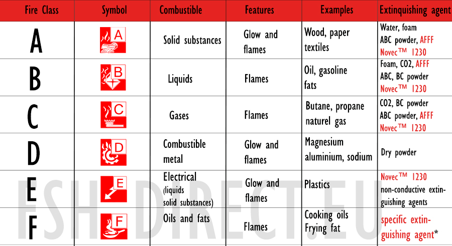

# Domain 3: Security Architecture and Engineering
## Table of Contents
- [Domain 3: Security Architecture and Engineering](#domain-3-security-architecture-and-engineering)
  - [Table of Contents](#table-of-contents)
  - [Topics](#topics)
  - [Notes](#notes)
    - [cryptography](#cryptography)
    - [cyberattacks](#cyberattacks)
    - [site and facility design](#site-and-facility-design)
    - [physical security](#physical-security)
    - [SOAP and REST](#soap-and-rest)
  - [More Notes](#more-notes)
      - [Encryption Algorithms](#encryption-algorithms)
      - [Hash Algorithms](#hash-algorithms)
      - [Certificate Formats](#certificate-formats)
  - [References](#references)

## Topics
- Secure design principles 
  - Threat modeling 
  - Least privilege
  - Defense in depth
  - Secure defaults 
  - Fail securely 
  - Segregation of Duties (SoD) 
  - Keep it simple and small 
  - Zero trust 
  - Trust but verify
  - Privacy by design 
  - Shared responsibility 
  - Secure access service edge
- Security models
  - Biba
  - Star Model
  - Bell-LaPadula 
- Controls 
- Security capabilities of information systems
  - memory protection 
  - Trusted Platform Module (TPM)
  - encryption 
  - decryption 
- Vulnerabilities of security architectures
  - Client-based systems
  - Server-based systems
  - Database systems 
  - Cryptographic systems 
  - Industrial Control Systems (ICS)
  - Cloud-based systems
    - Software as a service (SaaS)
    - Infrastructure as a service (IaaS)
    - Platform as a Service (PaaS)
  - Distributed systems 
  - Internet of Things (IoT)
  - Microservices
    - API
  - Containerization 
  - Serverless
  - Embedded systems 
  - High-performance computing systems 
  - Edge computing systems 
  - Virtualized systems 
- Cryptographic solutions
  - cryptography life cycle
    - keys
    - algorithm selection
  - Cryptographic methods 
    - symmetric
    - asymmetric
    - elliptic curves
    - quantum
  - Public key infrastructure (PKI)
    - quantum key distribution
- Cryptanalytic attacks
  - Brute force
  - ciphertext only
  - known plaintext
  - frequency analysis
  - Chosen ciphertext 
  - Implementation attacks 
  - Side-channel
  - Fault injection 
  - Timing
  - Man-in-the-middle (MITM)
  - Pass the hash
  - Kerberos exploitation
  - Ransomware
- site and facility security controls 
  - Wiring closets/intermediate distribution facilities
  - server rooms/data centers
  - media storage facilities 
  - evidence storage 
  - restricted and work area security 
  - utilities and heating, ventilation, and air conditioning (HVAC)
  - environmental issues 
    - natural disasters
    - man-made
  - power
    - redundant
    - backup 
- Information system lifecycle
  - stakeholder needs and requirements 
  - requirements analysis
  - architectural design 
  - development/implementation 
  - integration 
  - verification/deployment 
  - operations and maintenance/sustainment
  - retirement/disposal
 
## Notes
- Notes from Mike Chappelle Linkedin Learning
- subject/object model: 
- fail open: failed security controls are bypassed
- fail secure or fail closed: failed security controls block access 
- isolation: 
  - examples: network segmentation, process isolation, memory segmentation, virtual machine isolation
- segmentation: 
- security models
  - multilevel security: systems designed to operate at different security levels simultaneously while enforcing confidentiality and integrity constraints that restrict access between security levels 
  - Bell-LaPadula Model: enforces confidentiality. used mostly in military applications 
    - Rules
      1. Simple Security Rule: No "read up" 
      2. *-Property: No "write-down"
  - Biba Model: enforces integrity
    - Rules
      1. Simple integrity property: No "read down"
      2. *-Integrity property: No "write up" 
- Trusted Computer System Evaluation Criteria (TCSEC) or orange book: contained DoD computer security requirements. replaced in 2005 with common criteria
- Common Criteria: unified evaluation processes across NATO countries 
- Certification: determines that a system meets security criteria. not the same as accreditation  
- Accreditation: approves use of a system in a specific environment. same as authorization 
  - accreditation decisions:
    - authorization to operate (ATO)
    - interim authorization to operate (IATO)
    - interim authorization to test (IATT)
    - denial of authorization to operate (DATO)
- segregation of duties: no individual should possess two permissions that, in combination, allow them to perform a highly sensitive action 
- two-person control (or dual control): requires the authorization of two separate individuals to carry out a sensitive action
- privacy design principles: by IAPP
- privacy by design principles
  1. proactive, not reactive; preventive, not remedial 
  2. privacy as the default setting 
  3. privacy embedded into design 
  4. full functionality: positive sum, not zero sum 
  5. end-to-end security full lifecycle protection 
  6. visibility and transparency: keep it open
  7. respect for user privacy: keep it user-centric
- secure default 
  - zero trust: least privilege to network access 
- information system lifecycle
  1. stakeholder needs
  2. requirement analysis
  3. architectural design
  4. development / implementation 
  5. integration 
  6. verification & validation 
  7. transition / deployment  
  8. operations & maintenance 
  9. retirement / disposal
- cloud computing security
  - cloud service provider: offers cloud computing services for sale to third parties
  - purchases cloud computing services from one or more cloud service providers 
  - cloud access security broker (CASB): provides IAM services
  - managed security service providers (MSSPs): provide security services for other organizations as a managed service
  - network-based CASB: broker intercepts traffic between the user and the cloud service, monitoring for security issues 
    - broker can block requests
  - API-based CASB: broker queries the cloud service via API 
    - broker may not be able to block requests, depending upon API capabilities
- multitenancy: shared computing resources
- isolation: users don't impact each other
- oversubscription: sold capacity exceeds actual capacity
- resource pooling: CPU and memory shared among users
- hypervisor types
  - type 1 hypervisor: hypervisor runs directly on top of the hardware, then guest operating systems on top of that. Examples include VMWare ESXi, KVM, Microsoft Hyper-V
  - type 2 hypervisor: physical machine actually runs an operating system of its own, and the hypervisor runs as a program on top of that operating system. examples include VirtualBox and Parallels
- virtualization security
  - virtual machine isolation is critical
  - each server must have access to only its own memory and storage
  - VM escape attacks attempt to break out of the guest environment
- VM sprawl: unused and unmaintained servers
- virtual desktop infrastructure (VDI): provides network-based access to a desktop computing environment 
- application virtualization: streams applications to the user's desktop
- containers: lightweight alternative to virtual servers. uses host's operating system, runs on containerization platforms, contains application code and dependencies only
- ISO/IEC 17789:2014: ISO cloud reference architecture, defines cloud computing activities
  - customer activities: uses cloud services, perform service trials, monitor services, administer security, provide billing reports, handle problems, administer tenancies, perform business administration, services 
  - provider activities: prepare systems and services, monitor services, manage assets, provide audit data, manage customer relationships, perform peering, ensure compliance, provide connectivity, and more
  - partner activities: design, create, and maintain services, test services, perform audits, set up legal agreements, acquire and assess customers, assess the marketplace  
- Cloud Controls Matrix (CCM)
- cloud deployment models
  - private cloud: organization uses a dedicated cloud infrastructure
  - public cloud: orgs use a multitenancy infrastructure
  - hybrid cloud: orgs use both a private and public cloud
  - community cloud: shared with a consortium 
- Xaas: anything as a service
- Software as a Service (SaaS): customer purchases an entire app. Examples include Gmail and Box 
- Infrastructure as a Service (IaaS): customer purchases servers/storage
- Platform as a Service (PaaS): customer purchases app platform
- Function as a Service (FaaS): or serverless computing
- edge computing: computing on the endpoint
- fog computing: computing near the endpoint 
- horizontal scaling: adds more servers to the pool to meet increased demand
- vertical scaling: adds more resources to existing servers to meet demand
- automatic scaling: performs vertical or horizontal scaling on an automated basis
- memory types: 
  - read-only memory (ROM): contents may not be changed by applications or the operating system
  - random-access memory (RAM): contents may be changed by applications and the operating system
- memory management actions: tracks what applications are using each segment of memory, grants request for additional memory, frees up memory that is no longer needed
- memory protection: restricts access to memory segments 
- segmentation fault: error that occurs when the application requests unauthorized access to a memory segment  
- memory leak: applications accumulate memory over time and fail to release it when no longer needed
- AES Crypt: open source software for encryption 
- hardware security module (HSM): manages encryption keys
- trusted platform module (TPM): hardware encryption to typical computers
  - binding: data is encrypted in such a way that it's bound to a specific TPM's hardware and software config
    - TPM creating keys called endorsement keys and encrypting them so only TPM can be used for decryption
  - sealing: crypto operation that involves encrypting data, but not tied to TPM's state or config. only allows data to be decrypted in certain conditions such as after user authentication or in the presence of certain software 
    - creating a bound key that is also associated with certain computer config settings and parameters
- self-encrypting drive (SED): performs encryption automatically
- basic input/output system (BIOS): lightweight operating system stored in firmware that provides the basic functionality necessary to load the full operating system from disk 
- unified extensible firmware interface (UEFI): replaces bios with a flexible alternative
- secure boot: 
  1. read the boot loader from disk
  2. compute the hash of the boot loader
  3. decrypt the bool loader's digital signature 
  4. verify that the signature is accurate
- remote attestation: sends a compliance report to an external server 
- measured boot: each device verifies the hash of the next device in the boot chain
- attestation: confirmed hashes are stored in the TPM
- hardware root of trust: verifies firmware integrity for UEFI
- electromagnetic interference (EMI): electromagnetic waves, normally generated unintentionally, that cause disruption to nearby electronic equipment
- electromagnetic pulses (EMPs): extreme bursts of EMI, may be generated by a nuclear explosion
- database focused attacks
  - aggregation: individuals with a low-level security clearance may be able to piece together sensitive information by combining the facts available to them
  - inference: individual can figure out sensitive information from the facts available to them
- noSQL databases: uses key-value stores
- DynamoDB permissions
  - All item action (*): full database access
  - GetItem - retrieve a single item
  - BatchGetItem - retrieve many items 
  - PutItem - store a single item 
  - BatchWriteItems - store many items 
  - DeleteItem - remove an item
  - UpdateItem - modify an item
  - Query - search for items
- Large-Scale Parallel Data
  - computing problems that require the use of extremely large data sets and processing power that can't be handled by a single server or set of servers. These problems are divided into pieces and handled by distributed computing systems. example is Search for Extraterrestrial Intelligence (SETI), and Berkeley Open Infrastructure for Network Computing (BOINC)
- grid computing: assembles the unused processing capability of many computers at different locations to form a virtual supercomputer with a centralized controller 
- peer-to-peer (P2P) computing: assembles a diverse network of systems to offer a computing service without the need for a centralized controller. Examples include BitTorrent, Bitcoin, and Tor
- P2P security concerns
  - untrusted participants in the P2P network may gain access to sensitive information 
  - P2P participants may lose control of their computer systems to malicious P2P agents 
  - P2P nodes may find themselves the targets of law enforcement investigations
- ICS deployments: system automations for building, workflows, and process  
- ICS security: attacks have dramatic implications, systems are often not well secured, and systems are less likely to be current on patches
- ICS types:
  - Supervisory control and data acquisition (SCADA): remote monitoring + telemetry, and report back to control systems. has multiple points of attack
  - distributed control systems (DCS): common for food production. focuses on controlling processes, uses sensors and feedback systems, and has multiple points of attack
  - programmable logic controllers (PLC): handles specialized input and output, ensures uninterrupted processing. connects to a human machine interface
- operational technology (OT): includes hardware and software used to monitor and control physical devices. ICS is a type of OT
- IoT security challenges 
  - use difficult-to-update software and underlying OS 
  - connect to home and office wireless networks 
  - connect back to cloud services for command and control 
- IoT safety
  - smart devices require regular updates. auto updates or manual updates
  - check for weak default passwords
  - firmware version control: updates applied in orderly fashion
  - security wrappers: system that monitors input and output for security issues rather than directly connecting to network
  - segmenting embedded devices increases network security 
  - application firewalls: provides added protection for embedded devices 
- embedded system: technology components of an IoT device that place a full computer inside another, larger system
- system on a chip (SoC): combines processing, memory, networking, and other embedded system components on a single chip. Examples include raspberry pi's abd arduinos 
- field programmable gat arrays (FPGAs): chips that allow dynamic reprogramming 
  - eFUSE: technology from IBM that allows dynamic modification of the chip
- real-time operating systems (RTOs): provides reliable and secure computing for IoT devices
- CAN bus: facilitates embedded device communications 
- embedded system constraints: power, compute capabilities, and network capacity, cryptography, patching difficulties. 
  - cell networks may be able to help with coverage, use SIM cards to connect
- Zigbee and Z-Wave: short range communication standards for smart devices
- radio frequency comms: work when even cell networks are not available
- digital signal processing (DSP): made up of memory, compute engine, and input/output. takes an input, processes it, and provides an output 
- satellite comms tech: offers the widest global coverage, reaching remote and geographically isolated areas where other technologies cannot
### cryptography
- crypto involves tradeoff between security strength and resource consumption 
- symmetric encryption: encryption and decryption use the same secret key
- asymmetric encryption: or public key cryptography, encryption and decryption use different keys from the same pair 
  - public key: freely distributed to communications partners
  - private key: kept secret
  - anything encrypted with one key from a pair can be decrypted with the other key from that same pair
  - only need 2 key for each user
- computing number of symmetric keys required for a group to communicate: where n is the number of people that want to communicate, n(n-1)/2
- goals of cryptography
  - confidentiality: no unauthorized access 
  - integrity: no unauthorized changes
  - authentication: proof of identity claims 
  - obfuscation: hiding sensitive data
  - non-repudiation: verification of origin
- codes: system that substitutes one word or phrase for another. intended to provide secrecy and/or efficiency 
  - "10" code system used by police
- ciphers: systems that use algorithms to encrypt and decrypt messages
  - stream ciphers: operates on one character, or bit, of a message at a time 
  - block ciphers: operates on large segments of the message at the same time 
  - substitution ciphers: changes the characters in a message
  - rotation ciphers: type of substitution cipher if they shift letters by an increment
  - transposition ciphers: rearranges characters in a message
- operations
  - exclusive or (XOR): true when exactly one of two input values is true
- pseudorandom: algorithms that make almost random numbers
- confusion: every bit of ciphertext must depend on more than one bit of the encryption key
- diffusion: changing a single bit of the plaintext should change about 50% of the ciphertext bits
- obfuscation: uses cryptography to hide source code from users
- security through obscurity: security depends on the secrecy of its approach
- key length: cost/benefit analysis, select key length that balances security goals and speed of encryption/decryption
- choosing algorithm: use tested encryption modules and crypto service providers 
- one-time pad: unbreakable encryption algorithm, completely random
- crypto lifecycle: to phase out algorithms as they become insecure. ensures that crypto systems remain robust over time by evaluating and updating encryption methods, keys, and practices as vulns are discovered and computing power increases, which can render older algorithms less effective
- NIST cryptographic lifecycle
  1. Initiation: gather requirements for new cryptographic system
  2. Acquisition & development: finds appropriate combo of hardware, software, and algorithms that meet objective
  3. Implementation and assessment: configure and test crypto system
  4. Operations and maintenance: ensure continued secure operation og cryptographic system
  5. Sunset: phase out system and destroy/archive keying material
- Data Encryption Standard (DES): intended to serve as a federal encryption standard, enhanced interoperability of comms. designed by IBM in the 1970s. **no longer secure**
  - uses an encryption operation called Feistel function for 16 rounds of encryption 
- Feistel function: performs combo of substitution and transposition operations
- confusion: hides relationship between ciphertext and key. commonly carried out through substitution
- diffusion: hides relationship between plaintext and ciphertext. commonly carries out through transposition
- Triple DES: or 3DES, applies DES encryption 3 times 
- Blowfish: public domain algorithm by Bruce Schnier, designed as DES replacement. Uses Feistel network and combines substitution and transposition
- Twofish: same as blowfish details, but still considered secure
- Rijndael or Advanced Encryption Standard(AES)
  - uses substitution and transposition
- RC4: symmetric stream cipher used in network encryption by WEP, WPA, SSL, TLS. uses pseudorandom keystream, no longer considered secure
- cipher mode: how an algorithm encrypts and decrypts data 
  - electronic codebook (ECB) mode
  - cipher block chaining (CBC) mode
  - counter mode (CTR) mode: allows block ciphers to act more like stream ciphers
  - galois/counter mode (GCM): adds authentication capability
- steganography: hides data in large files, like hiding messages in image files 
- Rivest-Shamir-Adelman (RSA): early asymmetric algorithm. key pair are made using 2 large prime numbers. its slow, used to exchange symmetric keys
  - sender encrypts messages using the recipient's public key
  - recipient decrypts messages using their own private key
- pretty good privacy (PGP): asymmetric algorithm by phil zimmerman. OpenPGP and GnuPG (GPG) open source version. uses public and private keys, and combines both symmetric and asymmetric crypto
- elliptic curve cryptography: does not depend on prime factorization problem. cannot protect against quantum attacks 
- quantum computing: using quantum mechanics principles 
- quantum cryptography: not practical currently, but may be stronger than any modern approach
  - quantum key distribution is same
- out of band key exchange: uses a different channel 
  - examples: face to face meeting, physical mail, telephone
- in band key exchange: 
- diffie hellman key exchange: provides symmetric key exchange capability. difficulty lies in the discrete log complexity
- elliptic curve diffie hellman
- encryption key escrow: allows government access to keys 
  - Clipper chip: allowed goverment to access encrypted information. many lobbied against this chip
- recovery agents: allows internal access to lost keys 
- key stretching: takes a relatively insecure value, such as a password, and uses math techniques to strengthen it, making it harder to crack
  - salting: adds a value to the encryption key to make it more complex. protects against rainbow table attacks
  - hashing: adds time to the verification process by requiring more math
- password-based key derivation function v2 (PBKDF2): key stretching method, should be used 4,000 times
- bcrypt: uses blowfish and a salt to strengthen keys 
- hardware security modules (HSM): manages encryption keys and perform cryptographic operations
  - FIPS 140-3 security requirements for crptographic modeules, for HSM security for the government
- trust models
  - personal knowledge 
  - web of trust (WOT): relies on indirect relationships, participants digitally sign the public keys of people they know personally
    - decentralized, high barrier to entry, and requires technical knowledge
  - public key infrastructure (PKI): builds on web of trust with certificate authorities (CA)
- certificate authority (CA): trusted third-party organizations that verify the identity of individuals or organizations and then issue digital certificates containing both identity information and a copy of the subject's public key 
- hash functions: one-way function that transforms a variable length input into a unique, fixed-length output
- message digest 5 (MD5): created by ron rivest in 1991, producing 129-bit hashes. no longer secure
- SHA-3: Keccak algorithm that replaced SHA-2
- DSA: hash function, no longer used by the government 
- hash-based message authentication code (HMAC): combines symmetric crypto and hashes to provide authentication and integrity for messages. creates a message authentication code by using a secret key in conjunction with a hash function
- digital signatures: uses asymmetric crypto to achieve integrity, authentication, and non-repudiation. private key to create digital signatures, public key for decryption. 
  - FIPS 186-5 digital signature standard (DSS)
    - approved digital signature algorithms: RSA, ECDSA, EdDSA
- X.509 standard: 
- certificate signing request (CSR)
- registration authority (RA)
- subject alternative name (SANs)
- certificate revocation: invalidates compromised certificates 
- certificate revocation list (CRL): includes serial numbers of revoked certificates 
- online certificate status protocol (OCSP): provides real-time certificate status verification 
- certificate stapling: reduces CA's burden, often valid for 24 hours 
- self-signed certificates: for internal purposes, issued by an internal CA
- certificate chaining: allows the use of intermediate CAs
- offline CAs: protect sensitive root keys, root CAs are an example
- certificate subject: owns the public key. Could be servers, devices, individuals, or developers 
- certificate object identifiers (OIDs)
- certificate pinning: ties a certificate to a subject for a period of time 
- root certificates: protects CA private keys 
- wildcard certificates: covers an entire domain, only goes one level deep
- domain validation: validates domain ownership
- organizational validation: verifies business name
- extended validation: requires extensive investigation
- distinguished encoding rules (DER): binary format, uses DER, CRT, and CER file extensions
- PEM certificates: name comes from outdated privacy enhanced mail (PEM) standard 
  - ASCII text equivalents of DER certificates 
  - convert with OpenSSL
  - uses PEM or CRT extensions 
- personal information exchanges (PFX): binary format, commonly used by windows systems, uses PFX and P12 file extensions
- P7B format: ascii text equivalent of PFX certificates, commonly used by Windows systems, uses P7B file extension

### cyberattacks 
- brute force attacks: repeatedly guessing keys, type of ciphertext attack
- keyspace: the set of all possible encryption keys usable with an algorithm
- frequency analysis: detects patterns in ciphertext
- known plaintext attack: attacker has access to an unencrypted message
- chosen plaintext attack: attacker can create an encrypted message of their choice
- birthday attack: attacker finds two inputs with the same hash values
- eavesdropping attacks: rely on a compromised communications path. examples include network device tapping, DNS poisoning, and ARP poisoning
- man-in-the-middle attack
- replay attack: to prevent, use unique characteristics like token and timestamp
- SSL stripping: tricks browsers into using unencrypted communications 
- fault injection attack: uses externally forced errors to cause a system to behave in unexpected ways, allowing attackers to bypass security measures or extract sensitive information
- side channel attack: measures encryption foorprints 
- timing attack: measures encryption time
- entropy: reduces the predictability of cryptographic methods
- downgrade attacks: remove or weaken encryption 
- ransomware: encrypts data, demanding payment
- mimikatz: steals passwords from memory
- backups: provide a safety net for data
- antimalware: protects against infections

### site and facility design
- evidence storage locations: used to preserve chain of custody 
- intermediate distribution frames (IDF): hold central networking equipment
- wiring closets and distribution cabling
- data centers: expanded environmental envelope, can be cooled between 64.4F and 80.6F
  - dew point range: between 15.8F and 59F to keep static electricity and condensation away
- hot aisle/cold aisle approach: makes cooling data centers more efficient
- fire extinguishers: 
  - class A: common combustibles (wood, cloth, and trash)
  - class B: flammable liquids (gasoline and oil )
  - class C: electrical fires (data centers)
  - class D: heavy metal fires (industrial equipment)
  - class K: kitchen fires (fats and oils)
  

- other fire suppression methods
  - wet pipe: contains water in the pipes ready to deploy when a fire strikes
  - dry pipe: does not contains water until a valve opens during a fire alarm
- fire detection systems: temperature sensors, smoke detectors, incipient detector
- flooding risks
- electromagnetic interference (EMI): generated by all electronic equipment, interferes with normal operation of other equipment, enables eavesdropping attacks
- faraday cages: protect against electromagnetic interference
- redundant power supplies
  - uninterruptible power supplies (UPS): contain batteries capable of running equipment for a few minutes
  - backup generators: supply power during prolonged outages
- undervoltage conditions
  - blackouts: periods of complete service disruption
  - sags: momentary voltage drops
  - brownouts: extended voltage drops
- overvoltage conditions
  - spikes: momentary voltage increases
  - surges: extended voltage increases
- power conditioning: manages undervoltage and overvoltage situations
  
### physical security
- locks: restrict entry through portals
- cipher locks: require user to enter the correct combination
- biometic locks: use physical characteristic of a person to permit access 
- card reader locks: require a user present a magnetic stripe or proximity access card 
- tailgailing: unauthorized person following an authorized person into a building or other secure location
- mantraps: a double set of doors to prevent tailgaiting. can have space for 2 people in between. highly secure but expensive and reduce overall throughput
- turnstile: type of mantrap, allows only one person at a time. 
- waist-height turnstiles: best for high-throughput, low-threat environments, mostly for crowd control and deterrent
- optical turnstile: often infrared, typically barrier-free, instead using audible and visual alerting systems, and sometimes retracting glass panels, to alert others
- video surveillance: act as both a deterrent and detective controls, could use infrared technology. provides important records of physical access to facilities 
- fences: prevent physical intrusions on foot or by vehicle
- cages: may be used to separate equipment in data centers
- bollards: prevent vehicles from entering an area restricted to pedestrians
- proper lighting: increases likelihood of intruder detection
- signs: put intruders on notice that trespassing may result in legal action
- industrial camouflage: seeks to hide sensitive facilities in nondescript locations
- drone and UAVs: make physical security more complicated, facilities must look innocuous from ground and air
- visitor management procedures: protect against intrusions
  - describe allowable visit purposes
  - explain visit approval authority 
  - describe requirements for unescorted access 
  - explain role of visitor escorts 
  - all access should be logged, identified with distinctive badges, and cameras should be used for monitoring 
- security guards: receptionists may act as security guards, menacing look can be desirable, robot sentries may replace human security patrols 
- two-person integrity: two people must enter a sensitive area together
- two-person control: two people must jointly approve sensitive actions 

### SOAP and REST
- application programming interface (API): set of interfaces that allows users and other services to interact with a service programmatically 
- Simple Object Access Protocol (SOAP): api standard no longer widely used, uses XML format
- Representational State Transfer (REST): api standard overwhelmingly popular, uses HTTPS protocol
- api considerations
  - encrypt all API communications using HTTPS
  - secure distribution, storage, and transmission of API keys 
- service-oriented architecture (SOA): design philosophy that embraces the use of discrete services that may be accessed by customers in a black-box fashion
  - logical representations of repeatable business activity with a specified outcome
  - self-contained, black box nature
  - may be composed of other services
- microservices: fine-grained services

## More Notes
- From Destination CISSP eBook

#### Encryption Algorithms
| Algorithm                                     | Type       | Type Cipher                    | Key Length                       | Secure?                    |
| --------------------------------------------- | ---------- | ------------------------------ | -------------------------------- | -------------------------- |
| DES                                           | Symmetric  | Block cipher, 64-bit blocks    | 56 bits                          | No                         |
| Triple DES                                    | Symmetric  | Block cipher, 64-bit blocks    | 112 bits                         | No, being phased out       |
| Blowfish                                      | Symmetric  | Block cipher on 64-bit blocks  | between 32 and 448 bits          | No                         |
| Twofish                                       | Symmetric  | Block cipher on 128-bit blocks | 128, 192, or 256 bits            | No                         |
| Rijndael or Advanced Encryption Standard(AES) | Symmetric  | Block cipher, 128-bit blocks   | 128, 192, or 256 bits            | Yes                        |
| RC4                                           | Symmetric  | stream cipher                  | between 40 - 2048 bits           | No                         |
| RSA                                           | Asymmetric |                                | Between 1,024 (insecure) - 4,096 | Yes above key length 2,048 |
| PGP                                           | Asymmetric |                                |                                  |                            |
| Diffie Hellman Key Exchange                   |            |                                |                                  |                            |

#### Hash Algorithms

| Hash Algorithm | Hash value length    | Secure?    |
| -------------- | -------------------- | ---------- |
| MD5            | 129-bit              | No         |
| SHA-1          | 160-bit              | No         |
| SHA-2          | 224,256,384,512 bits | No         |
| SHA-3          | variable             | Yes        |
| RIPEMD         | 128,160,256,320-bits | 160 and up |

#### Certificate Formats 

| Binary Version | Binary File Extensions | Text Version | Text File Extensions |
| -------------- | ---------------------- | ------------ | -------------------- |
| DER            | .der, .crt, .cer       | PEM          | .pem, .crt           |
| PFX            | .pfx, .p12             | P7B          | .p7b                 |

## References