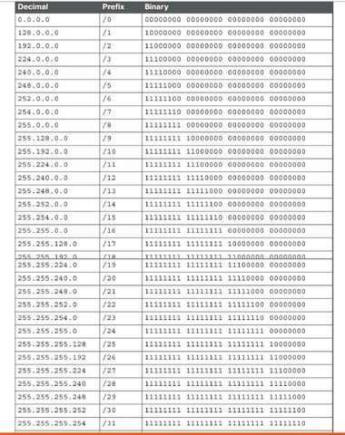

# Domain 4: Communication and Network Security
## Table of Contents
- [Domain 4: Communication and Network Security](#domain-4-communication-and-network-security)
  - [Table of Contents](#table-of-contents)
  - [Topics](#topics)
  - [Notes](#notes)
    - [Tables](#tables)
  - [References](#references)

## Topics
- Secure design principles in network architectures 
  - Open system interconnection (OCI)
  - TCP/IP Models 
  - IPv4 and IPv6
    - unicast
    - broadcast
    - multicast
    - anycast 
  - Secure protocols 
    - IPSec
    - SSH
    - SSL/TLS
  - Multilayer protocols
  - Converged protocols
    - Internet Small Computer Systems Interface (iSCSI)
    - Voice over Internet Protocol (VoIP)
    - InfiniBand over Ethernet 
    - Computer Express Link
  - Transport architecture
    - topology
    - data plane
    - control plane
    - management plane
    - cut through/store-and-forward
  - Performance metrics
    - bandwidth
    - latency
    - jitter
    - throughput
    - signal-to-noise ratio 
  - Traffic flows
    - north-south
    - east-west
  - Physical segmentation 
    - in-band
    - out-of-band
    - air-gapped
  - Logical segmentation 
    - VLANs
    - VPNs
    - virtual routing and forwarding 
    - virtual domain
  - Micro-segmentation 
    - network overlays/encapsulation
    - distributed firewalls
    - routers
    - IDS/IPS
    - zero trust
  - Edge networks
    - ingress/egress
    - peering
  - Wireless networks
    - bluetooth
    - WiFi
    - Zigbee
    - satellite
  - Cell/mobile networks
    - 4G, 5G
  - Content distribution networks (CDN)
  - Software defined networks (SDN)
    - API
    - Software-defined wide-area network
    - network functions virtualization 
  - Virtual Private Cloud (VPC)
  - monitoring and management
    - network observability
    - traffic flow/shaping
    - capacity management
    - fault detection and handling
- Secure network components
  - Operation of infrastructure 
    - redundant power
    - warranty
    - support
  - Transmission media
    - physical security of media
    - signal propagation quality
  - Network Access Control (NAC) systems
    - physical 
    - virtual solutions
  - Endpoint security 
    - host-based
- Secure communication channels
  - Voice, video, and collaboration
    - conferencing
    - Zoom rooms
  - Remote access
    - network administrative functions
    - Data communications
      - backhaul networks
      - satellite
    - Third-party connectivity 
      - telecom providers
      - hardware support

## Notes
- Notes from Mike Chappelle Linkedin Learning
- TCP/IP
- TCP: guarantees delivery 
  - flags:
    - three way handshake
      - SYN: opens a connection
      - FIN: closes a connection
      - ACK: acknowledges a SYN or FIN 
- UDP: light, connectionless protocol
  - doesn't send acknowledgements or guarantee delivery 
  - used for voice or video applications
- OSI model
- IP addresses
- subnetting
- ipv4 
- ipv6 
- static IPs 
- DHCP: automatically assigns IP addresses to systems as they join the network 
- unicast traffic
- broadcast traffic 
- multicast traffic 
- anycast 
- north south traffic: network traffic between systems in the data center and systems on the internet
- east west traffic: network traffic between systems located in the data center
- backhaul networks
- dns: address resolution on the internet, udp port 53
- dns servers: translates between domain names and IP addresses
  - dns is hierarchical 
  - organizations designate servers that are authoritative for their domains
- dns resolution
  1.  user types domain name into browser
  2.  computer sends a DNS query to the local DNS server
  3.  DNS server responds with an IP address 
- DNSSEC: adds digital signature to DNS
- port ranges
  - 0 - 1023: well known ports 
  - 1024 - 49151: registered ports 
  - 49152 - 65535: dynamic ports
- icmp: housekeeping protocol of the internet 
  - ping: identifies live systems 
    - icmp echo request
    - icmp echo reply
  - traceroute: identifies network paths
- TCP/IP: most common multilayer protocol suite
- Distributed Network Protocol (DNP3): provides network connectivity for SCADA systems. covers all levels of OSI stack
- public ip addresses: assigned by a central authority and are routable over the internet
- private ip addresses: available for anyone's use but not routable over the internet
  - private ip ranges:
    - 10.0.0.1 - 10.255.255.255
    - 172.16.0.1 - 172.31.255.255
    - 192.168.0.1 - 192.168.255.255
- network address translation (NAT): translates between public/private address 
  - hides internal addresses from internet systems 
  - limits direct access to systems 
  - makes it difficult to identify the true origin of traffic 
- port address translation (PAT)
  - allows multiple systems to share the same public address
  - assigns unique ports to each communication
- subnetting: subdivides large networks 
- subnet masks: identify the dividing line between network and host addresses
  

- network border firewall: 
- zero trust: system gains no trust based solely upon network location
- extranet: intranet segments extended to business partners
- honeynet: decoy networks designed to attract attackers
- ad hoc network: temporary networks that may bypass security controls
- network segmentation: separates systems of differing security levels
- jump servers: allows administrative connections between zones
- in-band management: manages isolated devices through the regular network
- out-of-band management: uses a dedicated management network
- air gapped: physically isolated systems with no direct access
- Virtual LANs (VLANS): separate systems on a network into logical groups based upon function, regardless of physical location
  - extends the broadcast domain 
  - to configure, enable VLAN trunking and assign switchports to VLANs
- virtual routing and forwarding (VRF): allows administrators to configure multiple routing tables on a single physical router
- virtual domains: divides a network into higher-level segments than VLANs with each segment corresponding to an organizational unit
- microsegmentation: uses extremely small network segments 
- network overlays: virtual networks created on top of a physical network allowing for the creation of highly customizable and isolated segments 
- encapsulation: technology that packages data packets inside of new packets for delivery over a network
- distributed firewalls: provides fine-grained filtering and policy enforcement
- network traffic collectors
  - intrusion detection and prevention sensors
  - network taps
  - port mirrors
- SPAN ports: receive a cope of all traffic seen on a switch
- port mirroring: allows the monitoring of traffic on a single switchport
- SIEM: gathers info using collectors, analyzes info with centralized aggregation and correlation engine. place collectors near systems generating records and correlation engine in a secure location
- VPN concentrators: aggregates remote user connections. often resides in their own VLAN, where access controls may restrict remote user activity. multiple VLANs for different user roles may be used
- SSL accelerators: handles difficult cryptographic work of setting up TLS connections, typically in DMZ
- load balancers: distributes connection requests among multiple servers, typically in DMZ
- DDoS mitigation tools: belong as close to the internet as possible, ideally can be purchased from your ISP
- software defined networking (SDN): treats network functionality and implementation details separately, and makes network programmable
  - SDN controller separates the control plane from data plane
- software defined visibility (SDV): allows visibility through virtual tapping, virtual net flow, and other features to analyze and summarize network traffic
- control plane: responsible for making routing and switching decisions
- data plane: responsible for carrying out the instructions of the control plane
- management plane: configures devices, monitors performance, and troubleshoots problems
- encapsulation: allows one protocol to carry traffic that uses another protocol
- VXLAN: "extended vlan" builds overlay networks that operate at layer 2 using layer 3 equipment
- Software-defined wide area networks (SD-WAN): connects larger areas. allows granular network configuration, and facilitates faster response to security incidents. however, increases network complexity 
- ethernet cables: transmits electricity over copper wires. cab ne affected by cable length, interference, and cable quality
- fiber optic cables: transmits light over strands of glass. better signal but fragile cables
- wifi: uses radio waves, quality depends on physical barriers, distance, and interference
- LiFi: uses light to transmit data wirelessly, employing LED lights to provide high-speed communication in a manner similar to WiFi, but with light waves instead of radio waves.
- cloud networking
- virtual private clouds (VPC): cloud providers version of a VLAN. connected to each other with VPC endpoints
- zero-trust network access (ZTNA): applies least privilege to network access. relies on strong authentication and identity management practices
  - capabilities include adaptive identity, threat scope reduction, policy driven access control, and implicity trust zones
  - policy enforcement point (PEP)
  - policy decision point
  - policy engine
  - policy administrator
- secure access service edge (SASE): combines SDN, STNA, CASB, FWaaS, and other network security services. long term goal, where zero trust is medium term
- switches: connect devices to the network, at layer 2 working with mac addresses. some function at layer 3
  - cut-through mode: switches begin forwarding packets before they have received the entire packet, reducing latency
  - store-and-forward mode: switches wait until they have received the entire packet before forwarding it. increases latency but reduces errors
- conduits: physical tubes (metal or PVC) used to route and protect network cables
- wireless access points (WAP): connects to switches and creates wifi networks
- routers: connect networks to each other, making intelligent packet routing decisions. also does stateless inspection with access control lists
- bridges: connect network using simple forwarding, divides network into various network segments, and maintains the MAC address table. also layer 2
- collision domain: network segment where collisions happen because more than one device attempts to send a packet at the same time
- network segment: examples like subnet @ layer 3, VLAN @ layer 2
- bus network: used in original ethernet design, inexpensive and easy to wire. allows only one system to transmit at the same time and breaks with a single wire failure
- ring network: uses a circular pattern, connects every device to two other devices. survives a single cable failure, but allows only one system to transmit at the same time. permits eavesdropping
- star network: current standard. connects every device directly to a switch, requires more wire and switches. allows every device to transmit simultaneously. prevents eavesdropping
- mesh network: connects every device to several other devices, requires too much wire in a wired network. improves reliability of wireless networks
- tree network: uses hierarchical design, interconnects star networks in "tree and star" topology
- transport architecture: guides the flow of data across a network
- peering agreements: connects two networks directly to each other
- firewalls: 
  - stateless firewalls: evaluates each connection independently
  - stateful inspection: tracks open connections
  - network hardware vs. host-based software firewall
- DMZ: 
- implicit deny: if the firewall receives traffic not explicitly allowed by a firewall rule, then that traffic must be blocked
- next generation firewalls (NGFW): incorporates contextual information into their decision-making
- proxy servers: connect to websites on a user's behalf 
  - benefits: anonymization, performance boosting, content filtering
- forward proxies: work on behalf of clients
- reverse proxies: work on behalf of servers
- transparent proxies: or in line proxies, work without the client or servers knowledge
- load balancers: distribute work among servers. also can do ssl certificate management, url filtering, and more
- autoscaling: automatically adds and removes servers as needed
- round robin scheduling: each server gets an equal number of requests
- session persistence: routes an individual user's request to the same server
- active-active mode: two or more load balancers actively handle network traffic and continue to function with diminished capacity if one device fails
- active-passive: one load balancer handles all traffic while a second monitors activity and assumes responsibility if the primary load balancer fails
- VPNs: virtual tunnel to connect systems
- site-to-site VPNs: connects remtoe offices to each other and headquarters
- remote access VPNs: provides remote access to corporate networks for mobile users
- IPSec: works at network layer (layer 3), supports L2TP, provides secure transport, and difficult to configure
- SSL/TLS VPNs: work at application layer (layer 7) over TCP port 443
- HTML5 VPNs: work entirely within the web browser
- full-tunnel VPN: all network traffic leaving the connected device is routed through VPN tunnel, regardless of final destination
- split-tunnel VPN: only traffic destined for corporate network is sent through VPN tunnel. Other traffic is routed directly over the internet
- always on VPN: connects automatically
- intrusion detection system (IDS): monitors network traffic for signs of malicious activity
  - example detections: SQL injections, malformed packets, unusual logins, and botnet traffic
- intrusion prevention system (IPS): blocks malicious activity automatically
- signature detection: contains databases with rules describing malicious activity, alerts admins to traffic matching signatures, though fails to detect brand new attacks. reduced false positive rates
- anomaly detection systems: also behavior based detection and heuristic detection builds models of "normal" activity. alerts asmins to activity not matching the model, detects previously unknown attacks, though has increased false positive rates
- protocol analyzers: allows deep inspection of traffic. used to troubleshoot network issues or investigate security incidents
- tcpdump: open source command line protocol analyzer
- libpcap: both tcpump and wireshark are built on this library
- tcpreplay: allows editing and replaying of traffic
- unified threat management (UTM): combines multiple security functions in a single appliance. protects network against attacks, blocks unsolicited traffic, and routes traffic to and from the internet. also has VPN connectivity, intrusion detection and prevention, url filtering, content inspection, malware inspection, email inspection
- content distribution networks (CDNs): provides scalability and security. has ondemand scaling, is cost efficient, has locality of content, and security enhancements like DDoS filtering and WAF functionality

### Tables

OSI Model

| Layers       | Description                      | Protocols |
| ------------ | -------------------------------- | --------- |
| Application  | User programs                    |           |
| Presentation | Data translation and encryption  |           |
| Session      | Exchanges between systems        |           |
| Transport    | TCP and UDP                      |           |
| Network      | Internet Protocol (IP)           |           |
| Data link    | Data transfers between two nodes |           |
| Physical     | Wires, radios, and optics |           |

TCP Model

| Layers      |
| ----------- |
| Application |
| Transport   |
| Internet    |
| Network Interface |

Common ports 

| Port(s)       | Protocol | Detailed Protocol                       |
| ------------- | -------- | --------------------------------------- |
| 21            | FTP      | File Transfer Protocol (FTP)            |
| 22            | SSH      | Secure Shell (SSH)                      |
| 3389          | RDP      | Remote Desktop Protocol (RDP)           |
| 137, 138, 139 | NetBIOS  | NetBIOS                                 |
| 53            | DNS      | Domain Name Service (DNS)               |
| 25            | SMTP     | Simple Mail Transfer Protocol (SMTP)    |
| 110           | POP      | Port Office Protocol (POP)              |
| 143           | IMAP     | Internet Message Access Protocol (IMAP) |
| 80            | HTTP     | HTTP                                    |
| 443           | HTTPS    | Secure HTTP                             |
|               |          |                                         |

## References