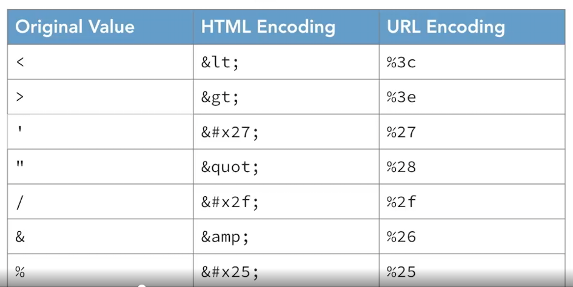

# Domain 8: Software Development Security
## Table of Contents
- [Domain 8: Software Development Security](#domain-8-software-development-security)
  - [Table of Contents](#table-of-contents)
  - [Topics](#topics)
  - [Notes](#notes)
  - [More Notes](#more-notes)
      - [tables](#tables)
  - [References](#references)

## Topics
- SDLC
  - Development methodologies
    - Agile
    - Waterfall
    - DevOps
    - DevSecOps
    - Scaled Agile Framework
  - Maturity models
    - Capability Maturity Model (CMM)
    - Software Assurance Maturity Model (SAMM)
  - Operation and maintenance
  - Change management
  - Integrated Product Team
- Software development security controls
  - Programming languages
  - Libraries
  - Tool sets 
  - IDE
  - Runtime
  - CI/CD
  - Software config management (CM)
  - Code repos
  - Application security testing 
    - SAST
    - DAST
    - Software composition analysis
    - IAST
- Assessing software security
  - auditing and logging
  - Risk analysis and mitigation 
- Security of acquired software
  - COTS
  - Open source
  - Third-party
  - Managed services 
    - enterprise applications
  - Cloud services
    - SaaS
    - IaaS
    - PaaS
- Secure coding guidelines 
  - Source code security weaknesses and vulns
  - Security of API 
  - Secure coding practices 
  - Software-defined security

## Notes
- Notes from Mike Chappelle Linkedin Learning
- endpoint application: self-contained on a device, does not interact with other systems
- client/server apps: interact with a server
- development methodologies
  - waterfall
    - system requirements
    - software requirements 
    - preliminary design
    - detailed design
    - code and debug
    - testing
    - operations and maintenance
  - spiral model
    - determine requirements
    - risk assessment
    - development and testing
    - begin again
  - agile methodology 
- integrated product team (IPT)
  - multifunctional team brought together to develop a product, process, or policy through parallel decision-making
- Scaled Agile Framework (SAFe): applies Agile principles at enterprise scale
- SAFe principles
  - take an economic view
  - apply systems thinking
  - assume variability; preserve options
  - build incrementally with fast, integrated learning cycles
  - base milestones on objective evaluation of working systems
  - make value flow without interruptions
  - apply cadence, synchronize with cross-domain planning
  - unlock the intrinsic motivation of knowledge workers
  - decentralize decision-making
  - organize around value
- SAFe configuration levels
  - Essential SAFe: uses traditional agile practices, teams work in agile release trains (ARTs). program increments last 8-12 weeks
  - Large Solution SAFe: works for large systems with multiple ARTs, provides additional roles and artifacts
  - Portfolio SAFe: strategic direction is translated into actionable items. investment themes guide work. work is aligned with business objectives, and Lean Portfolio Management (LPM) principles drive work
  - Full SAFe
    - includes all elements of Essential, Large Solution, and Full SAFe
    - adds additional guidance for business agility
    - supports enterprises that build solutions requiring hundreds of developers
- maturity models: provides standard benchmarks 
- CMM Steps
  - Level 1: Initial
  - Level 2: Repeatable
  - Level 3: Defined
  - Level 4: Managed
  - Level 5: Optimizing
- Capability Maturity Model Integration (CMMI): assesses an org's process maturity
  - level 1: Initial
    - work gets done but is subject to delays and budget overruns
  - level 2: Managed
    - configuration management
    - measurement and analysis
    - project monitoring and control
    - project planning
    - process and product quality assurance
    - requirements management
    - supplier agreement management
  - level 3: Defined
    - decision analysis and resolution
    - integrated project management
    - org process definition 
    - org training
    - org process focus
    - product integration
    - requirements development
    - risk management
    - technical solution
    - validation
    - verification
  - level 4: Quantitatively Managed
    - organizational process performance
    - quantitative project management
  - level 5: Optimizing
    - causal analysis and resolution
    - organizational performance management
- IDEAL model
  - Initiating
  - Diagnosing
  - Establishing
  - Action
  - Learning
- Software Assurance Maturity Model (SAMM): developed by OWASP
- DevOps Goals
  - build collaborative relationships
  - embrace automation
  - facilitate rapid release of code
  - provide stable operating environment
- infrastructure as code (IaC): scripts the creation of resources
  - increases scalability of environments, reduces user error, and facilitates testing of new code
- DevOps Tools
  - continuous validation
  - continuous integration
  - continuous delivery
  - continuous deployment
  - continuous monitoring
- interpreted languages: translates source code into machine language when the software runs
- compiled langues: uses compilers to create machine language executable files in advance
- reverse engineering: process of starting with a finished product, in hardware or software form, and decomposing it to determine how it was originally created
  - more difficult for compiled languages
- decompiler: assists with recreating source code from executable code by translating program binaries back into a human-readable format
- commercial off the shelf (COTS): purchased from third-party vendors and run on systems managed by the customer
- software as a service: software developed by vendors that runs in the cloud on vendor managed services
- OWASP Top Ten
  - broken access control: allows unauthorized access
  - cryptographic failure: allows access to sensitive data 
  - injection: inserts unwanted code
  - insecure design: fails to meet security requirements
  - security misconfiguration: occurs in many possible locations
  - vulnerable and outdated components: jeopardizes application security
  - identification and authentication failures: allows exploitation of session management
  - software and data integrity failures: allows insertion of insecure code
  - security logging and monitoring failures: deprives analysts of needed data
  - server side request forgery: tricks servers into requesting URLs
- SANS and CIS has similar lists to OWASP Top Ten
- purchased software: acquired from software venders for use in many different orgs
- developed software: custom written to meet specialized needs of a single org
- application hardening
  - use proper authentication
  - encrypt sensitive data
  - validate user input
  - avoid and remediate known exploits 
  - deploy obfuscation and camouflage 
- application configuration
  - type and scope of encryption
  - users with access to the application
  - access granted to authorized users
  - security of underlying infrastructure
- configuration baselines: allows quick identification and remediation of security gaps
- input validation: protects against unsafe user input by checking it on the server before executing commands
  - should always be performed on the server
- parameterized SQL: precompiles SQL on database server to prevent user input from altering query structure
- cross-site scripting (XSS): attacker embeds malicious scripts in a third-party website that's later run by innocent visitors to that site
  - protection includes input validation
- cross-site request forgery (XSRF or CSRF): leverages the fact that users are often logged into multiple sites at the same time and use one site to trick the browser into sending malicious requests to another site without the user's knowledge 
- defending against CSRF
  - rearchitect web applications
  - prevent use of HTTP GET requests
  - advise users to log out of sites
  - auto log out users after an idle period
- server-side request forgery (SSRF): request forgery attack that targets servers by manipulating servers into retrieving malicious data from what it believes to be a trusted source
- buffer overflow attacks: uses input larger than the buffer
- cookies
  - be careful that cookies are random
  - make sure "secure cookies" are set on, so cookies are sent using encryption
- cookie risks
  - cookies can be used across different websites
  - cookies can track user activity
  - if you log into one site, everything is de-anonymized
  - might attract the cookie monster
- cookie guessing: possible if cookie values are not randomly generated
- session replay: possible if cookie values are not encrypted in transit
- code execution attacks: occurs when an attacker exploits a vuln in a system that allows the attacker to run commands on that system
- arbitrary code execution: code execution attacks where the attacker runs commands of his or her choice
- remote code execution: code execution attacks that take place over a network connection
- code execution objectives
  - install malicious code
  - join a system to a botnet
  - steal sensitive information
  - create accounts for later access
- protections against RCE
  - limit admin access
  - patch systems and applications
- directory traversal: where an attacker attempts to access files and directories that are stored outside the web root folder
- privilege escalation attack: to gain admin access
  - often exploit buffer overflow vulns
- mitigating privilege escalation
  - perform input validation
  - patch operating systems, platforms, and applications
  - enforce least privilege principle
  - use DEP and ASLR technologies
- device drivers: serve as software interfaces between hardware devices and the operating system
- refactoring: modifying a driver to carry out malicious activities. requires access to the driver source code
- shimming: wraps a legitimate driver with a malicious shim. does not require access to the legitimate driver's source code
- malicious drivers
  - code signing can protect against this
- memory management: secure, isolated memory for each system process
- resource exhaustion: may slow down or disable a system
- memory overflow: allows arbitrary code execution
- memory leak: fails to release memory for reuse
- null pointer dereferencing
- DLL injection: tricks an app into loading malicious code
- race condition: occurs when the proper functioning of a security control depends upon the timing of actions performed by the user or computer
  - uncontrolled race conditions can be significant security vulnerabilities
- time of check/time of use: time elapsing between authorization and the action, leading to unauthorized actions or access
- locks: prevents simultaneous transactions from causing race conditions
- input validation approaches
  - whitelisting (allowlisting): specifies allowable input
  - blacklisting (blocklisting): specifies disallowed input. more difficult and less effective than whitelisting
- parameterized query: SQL template is precompiled on the database server
- stored procedures: uses parameterized queries, protects against SQL injection
- transport layer security (TLS): encrypts web traffic
- output encoding: replaces dangerous characters
  - use trusted libraries to perform encoding
- HTML encoding: uses "&" notation to replace dangerous values that appear in an HTML based web document
- URL encoding: uses "%" notation to replace dangerous values that appear in a URL
- inappropriate handling
- unpredictable states: jeopardizes application security
- error handling: avoids unpredictable states
- code signing: provides users with confidence that software comes from a trusted source
  - implemented with digital signatures
- digital signatures: provide nonrepudiation
- signing code
  1. developer obtains a digital certificate
  2. developer creates a digital signature for the code using the private key associated with the cert
- verifying code signatures
  1. user downloads the software
  2. OS uses the cert's public key to validate the signature
  3. OS verifies the signature's hash matches the code
  4. OS verifies that the developer is trusted
- database normal forms: design rules for columns and tables
- reasons for db normalization
  - prevent data inconsistency
  - prevent update anomalies
  - reduce need for restructuring existing databases
  - make db schema more informative
- first normal form (1NF): don't need to know for exam?
  1. create separate tables for different sets of related data
  2. provide a primary key for every table
  3. records may not have multivalued fields
  4. records in a table must have the same number of fields
- second normal form (2NF)
  - table must be in 1NF
  - every non-key field must be a fact about the entire key
- third normal form (3NF)
  - table must be in 2NF
  - no non-key field may be a fact about another non-key field
- obfuscation and camouflage: to hide locations of sensitive information
- database activity monitoring: logs and analyzes database requests
- deidentification: removes obvious identifiers
- anonymization: removes possibility of identification
  - HIPAA has deidentification standards/methods
    - expert determination
    - safe harbor 
- data obfuscation: transforms personally identifying info into a form where it's no longer possible to tie it to an individual person
- rainbow table attack: compares hash values with precomputed hashes
- tokenization: replaces sensitive fields with a random identifier, can be reversed or detokenized
- masking: redacts sensitive info from a file. replaces with dummy data, can't be reversed

## More Notes
- From Destination CISSP eBook

#### tables
Common encodings

## References