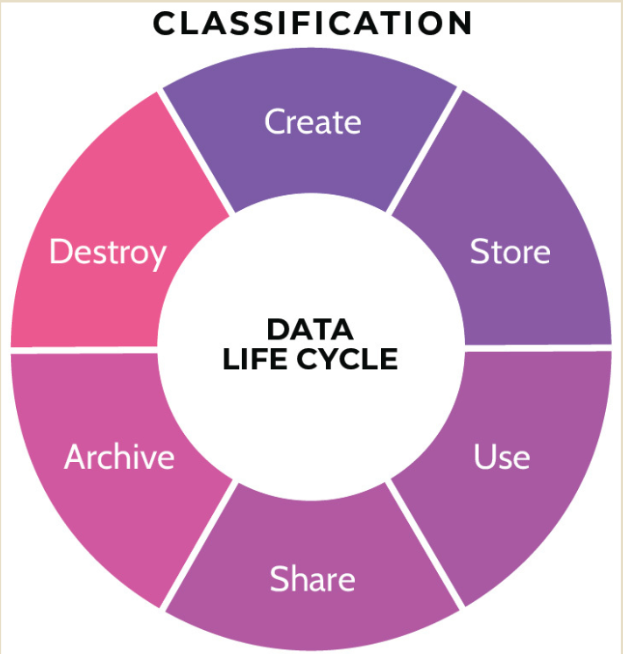
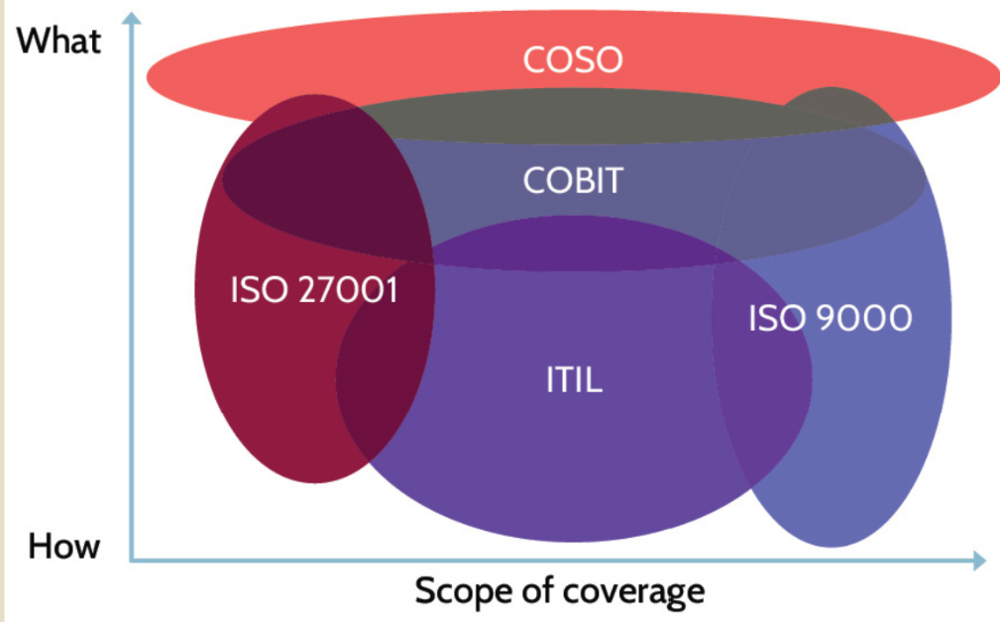

# Models, Processes, Frameworks
From Pete

### Domain 1 
- NIST 800-37
- STRIDE
- PASTA
- DREAD
- VAST 
- TRIKE
- COBIT 

### Domain 2
- Asset Classification Steps 
- Information lifecycle

- Data classification 

| Gov't        | Private                    |
| ------------ | -------------------------- |
| Unclassified | Public                     |
| Confidential | Sensitive                  |
| Secret       | Private                    |
| Top Secret   | Confidential / Proprietary |

- Common Criteria 
  - in domain 3 in dest cert
- TCSEC
- ITSEC

### Domain 3 
- Zero Trust
- Cyber Kill Chain
- Privacy by design
- Biba
- Star Model
- Bell-LaPadula
- Information Flow
- Clark-Wilson
- Brewer-Nash
- Graham-Denning
- Harrison-Ruzzo-Ullman
- Lipner
- state machine model
- information flow model
- noninterference model
  

- TCB
- ring protection model

### Domain 4 
- OSI Model

### Domain 5 

### Domain 6 
- 800-53a
- identity and access provisioning lifecycle

### Domain 7 

### Domain 8 