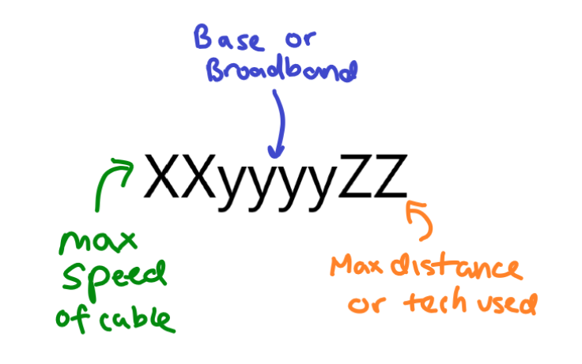

# ISC2 CISSP Study Guide, Seventh Edition

- [ISC2 CISSP Study Guide, Seventh Edition](#isc2-cissp-study-guide-seventh-edition)
  - [Chapter 1](#chapter-1)
  - [Chapter 11](#chapter-11)
    - [Cabling](#cabling)
      - [Coaxial Cable](#coaxial-cable)
      - [Baseband and Broadband Cables](#baseband-and-broadband-cables)
      - [Twisted-Pair](#twisted-pair)
      - [Conductors](#conductors)
    - [Network Topologies](#network-topologies)
      - [Ring](#ring)
      - [Bus](#bus)
      - [Star](#star)
      - [Mesh](#mesh)
    - [Wireless Communications and Security](#wireless-communications-and-security)
      - [Cell Phones](#cell-phones)
      - [Bluetooth](#bluetooth)
      - [Cordless Phones](#cordless-phones)
      - [Mobile Devices](#mobile-devices)
    - [LAN Technologies](#lan-technologies)
      - [Ethernet](#ethernet)
      - [Token Ring](#token-ring)
      - [FDDI](#fddi)
      - [Subtechnologies](#subtechnologies)
      - [LAN Media Access](#lan-media-access)
  - [Chapter 12](#chapter-12)
    - [Secure Communications Protocols](#secure-communications-protocols)
    - [Authentication Protocols](#authentication-protocols)
    - [Secure Voice Communications](#secure-voice-communications)
    - [Email Security](#email-security)
      - [Email Security Issues](#email-security-issues)
      - [Email Security Solutions](#email-security-solutions)
    - [Dial-Up Protocols](#dial-up-protocols)
    - [Centralized Remote Authentication Services](#centralized-remote-authentication-services)
    - [VPN](#vpn)
    - [VLAN, Virtual LAN](#vlan-virtual-lan)
    - [Virtualization](#virtualization)
    - [Network Address Translation](#network-address-translation)

## Chapter 1

## Chapter 11

### Cabling

#### Coaxial Cable

_coaxial cable_: center core of copper wire surrounded by a layer of insulation, then surrounded by a conductive braided shielding and encased in a final insulation sheath. not used as much anymore, now twisted-pair is the more popular alternative.

- Types
  - _thinnet_: or 10Base2, connected systems to backbond trunks of thicknet cabling, spans distances of 185 meters and throughput up to 10 Mbps
  - _thicknet_: or 10Base5, can span 500 meters and throughput up to 10 Mbps
- Problems
  - Bending coax cable past max arc
  - deploying coax cable past max recommended length
  - not properly terminating the ends of the coax cable with a 50 ohm resistor

#### Baseband and Broadband Cables

_Baseband_: can transmit only one single signal at a time

- most cables are baseband cables

_Broadband_: can transmit multiple signals simultaneously

| Type                 | Max Speed | Distance      | Difficulty of Installation | Susceptibility to EMI | Cost      |
| -------------------- | --------- | ------------- | -------------------------- | --------------------- | --------- |
| 10Base2              | 10 Mbps   | 185 meters    | Medium                     | Medium                | Medium    |
| 10Base5              | 10 Mbps   | 500 meters    | High                       | Low                   | High      |
| 10Base-T (UTP)       | 10 Mbps   | 100 meters    | Low                        | High                  | Very low  |
| STP                  | 155 Mbps  | 100 meters    | Medium                     | Medium                | High      |
| 100Base-T/100Base-TX | 100 Mbps  | 100 meters    | Low                        | High                  | Low       |
| 1000Base-T           | 1 Gbps    | 100 meters    | Low                        | High                  | Medium    |
| Fiber-optic          | 2+ Gbps   | 2+ kilometers | Very High                  | None                  | Very High |

#### Twisted-Pair

_twisted-pair_: four pair wires twisted around each other and sheathed in PVC insulator.

- each wire pair is twisted at a different length so signals traveling over the pairs cannot cross across pairs. the tighter the twist the more resistent the cable is to internal and external interference and crosstalk, and capacity for throughput is greater.
- Types
  - _STP: shielded twisted-pair_, the metal foil wrapper around the wires underneath the external sheath.
  - _UTP: unshielded twisted-pair_, without the foil. refers to 10Base2, 100Base-T, or 1000Base-T, all outdated.
- Problems
  - wrong category of twisted-pair cable for high-throughput networking
  - deloyinh twisted-pair longer than max recommended length
  - using UTP in environments with significant interference

_UTP categories_

| UTP Category | Throughput | Notes                                                                                     |
| ------------ | ---------- | ----------------------------------------------------------------------------------------- |
| Cat 1        | Voice Only | Not suitable for networks but usable by modems                                            |
| Cat 2        | 4 Mbps     | Not suitable for most networks                                                            |
| Cat 3        | 10 Mbps    | Mostly used in 10Base-T Ethernet networks                                                 |
| Cat 4        | 16 Mbps    | Mostly used in Token Ring networks                                                        |
| Cat 5        | 100 Mbps   | Used in 10Base-TX, FDDI, and ATM networks                                                 |
| Cat 5e       | 100 Mbps   | Enhanced Cat 5 to protect against crosstalk. used by 100Base-T and 1000Base-T deployments |
| Cat 6        | 1,000 Mbps | Used in high-speed networks                                                               |
| Cat 7        | 10 Gbps    | Used on 10 gigabit-speed networks                                                         |

#### Conductors

- Types
  - _Copper_: one of the best and least expensive
  - _Plenum cable_: does not release toxic fumes when burned
  - _fiber-optic cable_: transmits pulses of light rather than electricity.
- Terms
  - _maximum length_: point where level of degradation could interfere with transmission of data.
  - _attenuation_: degradation of signal
  - _repeater_: signal amplification device, boosts the signal strength of an incoming data stream and rebroadcasts it through its second port
  - _concentrator_: same as repeater but it has more than two ports.
    - use of more than four repeaters in a row is discouraged, 5-4-3 rule

### Network Topologies

- _logical topology_: grouping of networked systems into trusted collectives.

#### Ring

- _ring topology_: connects each system as points on a circle. only one system can transmit data at a time. if one segment of the loop is broken, all communication around the loop ceases.
  - _token_: digital hall pass that travels around the ring until a system grabs it. traffic management is performed by a token.

#### Bus

- _bus topology_: connects each system to a trunk cable. all systems on the bus can transmit data simultaneously, which can result in collisions. when data is transmitted, all systems on the network can hear the data. if a single segment fails, communications on all other segments continue uninterrupted. the central trunk line remains a single point of failure.
- rarely used today, because it must be terminated at both ends and any disconnection can take down the entire network.

- Types
  - linear bus: single trunk line with all systems directly connected to it
  - tree bus: single trunk line with branches that can support multiple systems

#### Star

- _star topology_: centralized connection device, hub or switch. each system is connected to the central hub by a dedicated segment. if one segment fails, the other segments can continue to function. the central hub is a single point of failure.
- uses less cabling than other topologies, and makes identifying damaged cables easier
- logical bus and logical ring can be implemented as a physical star
  - Ethernet: bus-based but can be deployed as a physical star
  - Token Ring: ring-based but can be deployed as a physical star using MAU
    - MAU: multistation access unit, allows for cable segments to be deployed as a star while internally the device makes logical ring connections

#### Mesh

- _mesh topology_: connects systems to other systems using numerous paths. provides redundant connections to systems, allowing multiple segment failures without seriously affecting connectivity
  - full mesh topology: connects each system to all other systems on the network
  - partial mesh topology: connects many systems to many other systems.

### Wireless Communications and Security

- _frequency_: a measurement of the number of wave oscillations within a specific time and identified using the unit Hertz (Hz), or oscillations per second
  - radio waves have a frequency between 3 Hz and 300 GHz
- _spread spectrum_: communication occurs over multiple frequencies at the same time. a message is broken into pieces and each piece is sent at the same time but at a different frequency, effectively parallel communication.
- _FHSS_: Frequency Hopping Spread Spectrum, early implementation of the spread spectrum concept, but transmits data in a series while constantly changing the frequency in use
- _DSSS_: Direct Sequency Spread Spectrum, employs all the available frequencies simultaneously in parallel to provide a higher rate of data throughput than FHSS. also uses chipping code to allow a receiver to reconstruct data even if parts of the signal were distorted because of the interference.
- _OFDM_: Orthogonal Frequency-Division Multiplexing, employs a digital multicarrier modulation scheme that allows for a more tightly compacted transmission. The modulated signals are perpendicular (orthogonal) thus do not cause interference with each other

#### Cell Phones

Cell Phone Technology Categories

- May be missing 5G technologies, this chart is from 2015

| Technology                     | Generation |
| ------------------------------ | ---------- |
| NMT                            | 1G         |
| AMPS                           | 1G         |
| TACS                           | 1G         |
| GSM                            | 2G         |
| iDEN                           | 2G         |
| TDMA                           | 2G         |
| CDMA                           | 2G         |
| PDC                            | 2G         |
| HSCSD                          | 2.5G       |
| GPRS                           | 2.5G       |
| W-CDMA                         | 3G         |
| TD-CDMA                        | 3G         |
| UWC                            | 3G         |
| EDGE                           | 3G         |
| DECT                           | 3G         |
| UMTS                           | 3G         |
| HSPDA                          | 3.5G       |
| WiMax - IEEE 802.16            | 4G         |
| XOHM (Brand name of WiMax)     | 4G         |
| Mobile Broadband - IEEE 802.20 | 4G         |
| LTE (Long Term Evolution)      | 4G         |

- _WAP_: Wireless Application Protocol, a functioning protocol stack. Suite of protocols working together to connect from cell phone to the Internet.
  - Example of protocol is WTLS, Wireless Transport Layer Security, similar to SSL or TLS
  - NOT the same as WAP, wireless access point, when used in relation to 802.11
  - end-to-end encryption is not possible because of CALEA wiretapping mandate
  - _CALEA_: Communications Assistance for Law Enforcement Act

#### Bluetooth

- _Bluetooth_: also IEEE 802.15, personal area networks (PANs), is where primary device scans 2.4 GHz radio frequencies for available devices, then 4 digit PIN "authorizes" the pairing. Range is 30 to 100 ft.
  - attacks
    - _bluejacking_: allows an attacker to transmit SMS-like messages to your device
    - _bluesnarfing_: allows hackers to connect to your Bluetooth device and extract information from them
    - _bluebugging_: grants hackers remote control over the feature and functions of a Bluetooth device
  - suggestions:
    - use Bluetooth for activities that are not sensitive or confidential
    - when possible change the default PIN on your devices
    - do not leave your device in discovery mode
    - always turn of Bluetooth when it's not in active use

#### Cordless Phones

- can use any unlicensed frequencies: 900MHz, 2.4GHz, or 5 GHz. Signal is rarely encrypted so eavesdropping is easy with a frequency scanner.

#### Mobile Devices

- suggestions
  - keep nonessential information off portable devices
  - run a firewall and antivirus product if available
  - keep the system locked and/or encrypted if possible
  - check that all desired security features are operating as expected on any device allowed to connect o the organization's network

### LAN Technologies

#### Ethernet

- _ethernet_: shared media LAN technology. Uses broadcast and collision domains
  - can support full-duplex communications and usually employs twisted-pair cabling
  - most often deployed on star or bus topologies
  - based on IEEE 802.3 standard
  - Terms
    - _broadcast domain_: physical grouping of systems where all the systems in the group receive a broadcast sent by a single system in the group.
    - _collision domain_: groupings of systems within which a data collision occurs if two systems transmit simultaneously.
    - _data collision_: takes place when two transmitted messages attempt to use the network medium at the same time. it causes one or both messages to be corrupted
    - _frames_: individual units of Ethernet data

#### Token Ring

- _token ring_: employs a token-passing mechanism to control which systems can transmit data over the network medium
  - the token travels in a logical loop among all members of the LAN 
  - can be deployed on ring or star network topologies 
  - rarely used today because of performance limitations, higher cost, and increased difficulty in deployment and management 
  - ring-based but can be deployed as a physical star using MAU

#### FDDI

- _FDDI_: Fiber Distributed Data Interface, high speed token-passing technology that employs two rings with traffic flowing in opposite directions 
  - often used as a backbone for large enterprise networks 
  - _CDDI_: Copper Distributed Data Interface, uses twisted pair cables, uses less-expensive, distance limited, and slower
    - more vulnerable to interference and eavesdropping

#### Subtechnologies

- _analog_: continuous signal that varies in frequency, amplitude, phase, voltage, etc.
- _digital_: on/off pulses of discontinuous electrical signals
- _synchronous_: relies on a timing mechanism 
- _asynchronous_: relies on stop and start delimiter bit to manage the transmission of data
- _baseband_: support only a single communication channel
- _broadband_: can support multiple simultaneous signals
- _broadcast_: communication to all possible recipients
- _multicast_: communication to multiple specific recipients
- _unicast_: only to a single recipient

#### LAN Media Access

- _CSMA_: Carrier-Sense Multiple Access
  - does not directly address collisions
- _CSMA/CA_: Carrier-Sense Multiple Access with Collision Avoidance
  - examples: appletalk and 802.11
  - attempts to avoid collusions by granting only a single permission to communicate at any given time
  - needs a primary system, to respond to requests and grants permission to send data transmissions
- _CSMA/CD_: Carrier-Sense Multiple Access with Collision Detection
  - example: ethernet
  - responds to collisions by having each member of the collision domain wait a random period of time before starting the process over 
- _token passing_: LAN media access technology that communicates using a digital token. 
- _polling_: LAN media access technology that performs communications using a primary / secondary configuration. 
  - SDLC, Synchronous Data Link Control, uses polling
  - inverse of the CSMA/CA method

## Chapter 12

### Secure Communications Protocols
- SKIP: 
- swIPe: 
- S-RPC: 
- SSL: 
- TLS: 
- SET: 

### Authentication Protocols
- _CHAP_: Challenge Handshake Authentication Protocol
- _PAP_: Password Authentication Protocol
  - offers no form of encryption, transmits usernames and passwords in the clear
- _EAP_: Extensible Authentication Protocol

### Secure Voice Communications
- VoIP: Voice over Internet Protocol
- PBX: private branch exchange
- Social Engineering
- Fraud and Abuse
  - _phreakers_: malicious actors that abuse phone systems
    - Tools
      - _Black boxes_: manipulates line voltages to steal long-distance services
      - _Red boxes_: simulates tones of coins being deposited into a pay phone
      - _Blue boxes_: simulated 2600 Hx tones to interact directly with telephone network trunk systems 
      - _White boxes_: used to control the phone system
  - DISA: Direct Inward System Access 
    - designed to help manage external access and external control of a PBX by assigning access codes to users

### Email Security
- SMTP: Simple Mail Transfer Protocol
  - Sendmail: most common SMTP server for Unix systems
  - Exchange: most common SMTP server for Microsoft systems
- POP3: Post Office Protocol version 3
- IMAP: Internet Message Access Protocol '

#### Email Security Issues
- Spoofing
- DoS
- Mail-bombing

#### Email Security Solutions
- S/MIME: 
- MOSS: 
- PEM: 
- DKIM: 
- PGP: Pretty Good Privacy 

### Dial-Up Protocols
- _PPP_: Point-to-Point Protocol
- _SLIP_: Serial Line Internet Protocol

### Centralized Remote Authentication Services 
- _RADIUS_: Remote Authentication Dial-In User Service
- _TACACS+_: Terminal Access Controller Access-Control System

### VPN
- tunneling: network communications process that protects the contents of protocol packets by encapsulating them in packets of another protocol
- PPTP: Point-to-Point Tunneling Protocol
- L2F: Layer 2 Forwarding Protocol
- L2TP: Layer 2 Tunneling Protocol
- IPSec: IP Security Protocol
  - AH: Authentication Header, provides authentication, integrity, and nonrepudiation
  - ESP: Encapsulating Security Payload, provides encryption to protect the confidentiality of transmitted data

| VPN Protocol | Native Authentication Protection | Native Data Encryption | Protocols Supported | Dial-Up Links Supported | Number of Simultaneous Connections |
| ------------ | -------------------------------- | ---------------------- | ------------------- | ----------------------- | ---------------------------------- |
| PPTP         | Yes                              | No                     | PPP                 | Yes                     | Single point-to-point              |
| L2F          | Yes                              | No                     | PPP/SLIP            | Yes                     | Single point-to-point              |
| L2TP         | Yes                              | No (can use IPSec)     | PPP                 | Yes                     | Single point-to-point              |
| IPSec        | Yes                              | Yes                    | IP only             | No                      | Multiple                           |

### VLAN, Virtual LAN

- _VLAN_: used to logically segment a network without altering its physical topology
- VLAN vs subnet
  - VLANs are created by switches, subnets are created by IP address and subnet mask assignments 

### Virtualization 

-_software-defined networking_: separates the infrastructure layer from the control layer, and removes the traditional networking concepts of IP addressing, subnets, routing, etc. from needing to be programmed into hosted applications. directly programmable, network virtualization 

-SAN: storage area network, combines multiple individual storage devices into a single consolidated network-accessible storage container. 

### Network Address Translation 

- NAT: converts internal IP addresses into public IP addresses for transmission over the Internet
- PAT: port address translation 
- private IP addresses
- stateful NAT
- static NAT: 
- dynamic NAT: 

